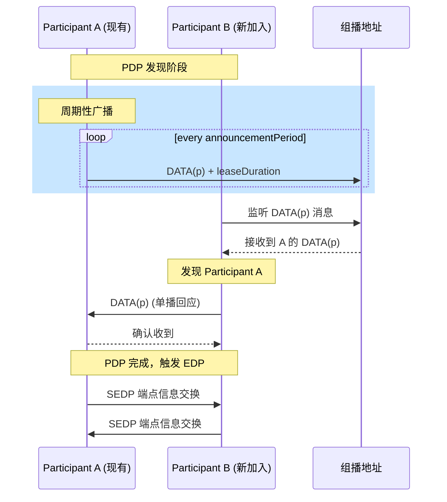
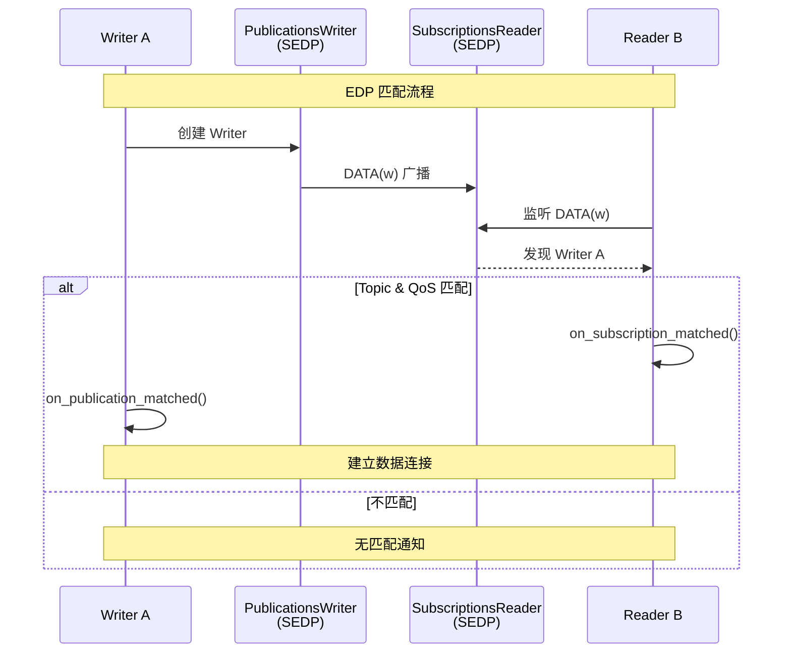
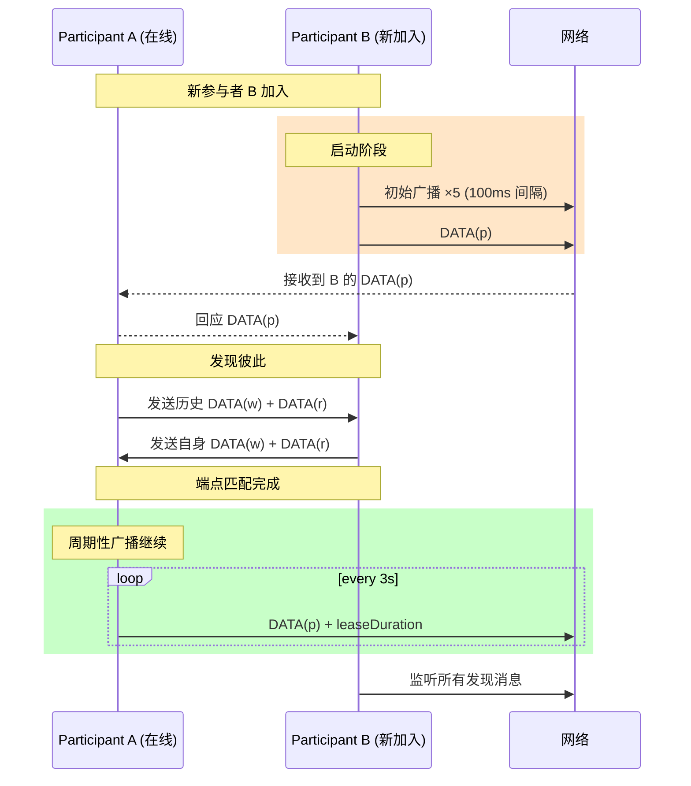

# Fast-DDS 发现机制 (Discovery) 详解

## 目录

1. [概述](#概述)
2. [Simple Discovery 协议架构](#simple-discovery-协议架构)
3. [Participant Discovery Protocol (PDP)](#participant-discovery-protocol-pdp)
4. [Endpoint Discovery Protocol (EDP)](#endpoint-discovery-protocol-edp)
5. [Discovery 消息流程图](#discovery-消息流程图)
6. [动态加入与离开处理](#动态加入与离开处理)
7. [关键配置参数详解](#关键配置参数详解)
8. [代码示例](#代码示例)
9. [总结](#总结)

---

## 概述

Fast-DDS 的发现机制是 DDS 分布式系统的核心组件，负责自动发现网络中的参与者（Participant）、数据写入者（Writer）和数据读取者（Reader）。Fast-DDS 实现了 **RTPS (Real-Time Publish Subscribe) 标准** 中定义的 Simple Discovery Protocol。

### 发现协议的分层架构

```
┌─────────────────────────────────────────────────────────────┐
│                    Simple Discovery                         │
├─────────────────────┬───────────────────────────────────────┤
│   PDP (Participant) │            EDP (Endpoint)             │
│   Discovery Protocol│        Discovery Protocol             │
├─────────────────────┼───────────────────────────────────────┤
│ • 发现参与者        │ • 发现 Writers                        │
│ • 交换元数据        │ • 发现 Readers                        │
│ • 维护参与者活性    │ • 匹配 Topic/QoS                      │
└─────────────────────┴───────────────────────────────────────┘
```

---

## Simple Discovery 协议架构

### 核心设计思想

Simple Discovery 基于**参与者自发现**的概念：
1. 每个参与者定期广播自己的存在信息
2. 新加入的参与者通过监听这些广播来发现现有参与者
3. 已发现的参与者之间交换端点信息，建立实际的数据通道

### 发现阶段

```
┌────────────────────────────────────────────────────────────┐
│                    Simple Discovery 阶段                    │
├────────────────────────────────────────────────────────────┤
│  Phase 1: Participant Discovery Protocol (PDP)             │
│  ├── 参与者周期性发送 DATA(p) 消息                         │
│  ├── 接收其他参与者的 DATA(p) 消息                         │
│  └── 建立参与者之间的通信通道                              │
├────────────────────────────────────────────────────────────┤
│  Phase 2: Endpoint Discovery Protocol (EDP)                │
│  ├── 交换 Writer 信息 (DATA(w))                            │
│  ├── 交换 Reader 信息 (DATA(r))                            │
│  └── 基于 Topic 和 QoS 进行匹配                            │
├────────────────────────────────────────────────────────────┤
│  Phase 3: 数据通信                                         │
│  ├── 匹配的 Writer-Reader 建立连接                         │
│  └── 开始用户数据传输                                      │
└────────────────────────────────────────────────────────────┘
```

---

## Participant Discovery Protocol (PDP)

### PDP 核心职责

PDP 负责管理**参与者级别的发现**，包括：
- 参与者信息的发布与订阅
- 维护远程参与者的活性状态
- 触发 EDP 进行端点发现

### PDP 类层次结构

```cpp
// 源码位置: src/cpp/rtps/builtin/discovery/participant/

PDP (抽象基类)
├── PDPSimple          // 标准 Simple PDP 实现
├── PDPServer          // Discovery Server 服务器模式
└── PDPClient          // Discovery Server 客户端模式
```

### PDP 内置端点

每个参与者创建两个关键的内置端点：

| 端点 | 类型 | EntityId | 用途 |
|------|------|----------|------|
| `BuiltinParticipantWriter` | StatelessWriter | 0x000100c2 | 发送 DATA(p) 消息 |
| `BuiltinParticipantReader` | StatelessReader | 0x000100c7 | 接收 DATA(p) 消息 |

### DATA(p) 消息内容

```cpp
// ParticipantProxyData 包含的关键信息
struct ParticipantProxyData {
    GUID_t guid;                          // 参与者唯一标识
    ProtocolVersion_t protocolVersion;    // RTPS 协议版本
    VendorId_t vendorId;                  // 厂商 ID
    LocatorList_t metatrafficLocators;    // 元数据传输地址
    LocatorList_t defaultLocators;        // 默认数据传输地址
    Duration_t leaseDuration;             // 活性租约时长
    // ... 其他 QoS 和属性
};
```

### PDP 发现流程时序图



### 源码解析：PDP 初始化

```cpp
// 源码: src/cpp/rtps/builtin/discovery/participant/PDPSimple.cpp

bool PDPSimple::init(RTPSParticipantImpl* part)
{
    // 1. 初始化 PDP 基础组件
    if (!PDP::initPDP(part)) {
        return false;
    }

    // 2. 初始化 EDP (Endpoint Discovery Protocol)
    if (m_discovery.discovery_config.use_STATIC_EndpointDiscoveryProtocol) {
        // 使用静态 EDP (通过 XML 配置)
        mp_EDP = new EDPStatic(this, mp_RTPSParticipant);
    }
    else if (m_discovery.discovery_config.use_SIMPLE_EndpointDiscoveryProtocol) {
        // 使用简单 EDP (动态发现)
        mp_EDP = new EDPSimple(this, mp_RTPSParticipant);
    }
    
    return mp_EDP->initEDP(m_discovery);
}
```

### 参与者活性维护

```cpp
// 源码: src/cpp/rtps/builtin/discovery/participant/PDP.cpp

void PDP::check_remote_participant_liveliness(ParticipantProxyData* remote_participant)
{
    // 检查租约是否过期
    if (remote_participant->lease_duration_expired()) {
        // 移除过期的参与者
        remove_remote_participant(
            remote_participant->guid, 
            ParticipantDiscoveryStatus::DROPPED_PARTICIPANT
        );
    }
}
```

---

## Endpoint Discovery Protocol (EDP)

### EDP 核心职责

EDP 负责管理**端点级别的发现**，包括：
- 发布和订阅 Writer/Reader 信息
- 基于 Topic 名称和 QoS 策略匹配端点
- 通知应用层匹配状态变化

### EDP 类层次结构

```cpp
// 源码位置: src/cpp/rtps/builtin/discovery/endpoint/

EDP (抽象基类)
├── EDPSimple          // 动态端点发现
└── EDPStatic          // 静态端点配置 (XML)
```

### EDPSimple 内置端点

EDPSimple 创建四个内置端点：

| 端点 | 类型 | EntityId | 用途 |
|------|------|----------|------|
| `PublicationsWriter` | StatefulWriter | 0x000003c2 | 发送 Writer 信息 |
| `PublicationsReader` | StatefulReader | 0x000003c7 | 接收 Writer 信息 |
| `SubscriptionsWriter` | StatefulWriter | 0x000004c2 | 发送 Reader 信息 |
| `SubscriptionsReader` | StatefulReader | 0x000004c7 | 接收 Reader 信息 |

### EDP 消息类型

```cpp
// WriterProxyData (DATA(w))
struct WriterProxyData {
    GUID_t guid;                    // Writer 唯一标识
    GUID_t participant_guid;        // 所属参与者 GUID
    string_255 topicName;           // Topic 名称
    string_255 typeName;            // 数据类型名称
    WriterQos qos;                  // Writer QoS 策略
    LocatorList_t unicastLocatorList;   // 单播地址
    LocatorList_t multicastLocatorList; // 组播地址
    // ...
};

// ReaderProxyData (DATA(r))
struct ReaderProxyData {
    GUID_t guid;                    // Reader 唯一标识
    GUID_t participant_guid;        // 所属参与者 GUID
    string_255 topicName;           // Topic 名称
    string_255 typeName;            // 数据类型名称
    ReaderQos qos;                  // Reader QoS 策略
    LocatorList_t unicastLocatorList;   // 单播地址
    LocatorList_t multicastLocatorList; // 组播地址
    // ...
};
```

### EDP 匹配流程

```cpp
// 源码: src/cpp/rtps/builtin/discovery/endpoint/EDP.cpp

bool EDP::valid_matching(
    const WriterProxyData* wdata,
    const ReaderProxyData* rdata,
    MatchingFailureMask& reason,
    PolicyMask& incompatible_qos)
{
    // 1. 检查 Topic 名称是否匹配
    if (wdata->topicName() != rdata->topicName()) {
        reason.set(MatchingFailureMask::different_topic);
        return false;
    }
    
    // 2. 检查 Topic 类型是否一致
    if (!check_type_consistency(wdata, rdata)) {
        reason.set(MatchingFailureMask::inconsistent_topic);
        return false;
    }
    
    // 3. 检查 QoS 兼容性
    if (!check_qos_compatibility(wdata, rdata, incompatible_qos)) {
        reason.set(MatchingFailureMask::incompatible_qos);
        return false;
    }
    
    // 4. 检查分区 (Partition) 匹配
    if (!check_partitions(wdata, rdata)) {
        reason.set(MatchingFailureMask::partitions);
        return false;
    }
    
    return true;  // 匹配成功！
}
```

### EDP 匹配时序图



---

## Discovery 消息流程图

### 完整发现流程

```mermaid
flowchart TB
    subgraph 参与者发现[Phase 1: PDP - 参与者发现]
        P1[Participant A] -->|DATA(p) 广播| M1((组播))
        P2[Participant B] -->|DATA(p) 广播| M1
        M1 -->|接收| P1
        M1 -->|接收| P2
    end
    
    subgraph 端点发现[Phase 2: EDP - 端点发现]
        P1 -->|DATA(w) + DATA(r)| P2
        P2 -->|DATA(w) + DATA(r)| P1
    end
    
    subgraph 匹配与通信[Phase 3: 匹配与数据通信]
        P1 -->|匹配检查| M[匹配引擎]
        P2 -->|匹配检查| M
        M -->|匹配成功| C[建立连接]
        C -->|用户数据| D[数据传输]
    end
    
    参与者发现 --> 端点发现
    端点发现 --> 匹配与通信
```

### 发现消息类型总结

```
┌────────────────────────────────────────────────────────────────┐
│                     RTPS Discovery Messages                     │
├────────────────────────────────────────────────────────────────┤
│ DATA(p) - Participant Data                                      │
│ ├── 发送者: BuiltinParticipantWriter                           │
│ ├── 接收者: BuiltinParticipantReader                           │
│ └── 内容: 参与者 GUID、地址、租约时长、协议版本                │
├────────────────────────────────────────────────────────────────┤
│ DATA(w) - Writer Data                                           │
│ ├── 发送者: PublicationsWriter                                 │
│ ├── 接收者: PublicationsReader                                 │
│ └── 内容: Writer GUID、Topic、QoS、传输地址                    │
├────────────────────────────────────────────────────────────────┤
│ DATA(r) - Reader Data                                           │
│ ├── 发送者: SubscriptionsWriter                                │
│ ├── 接收者: SubscriptionsReader                                │
│ └── 内容: Reader GUID、Topic、QoS、传输地址                    │
├────────────────────────────────────────────────────────────────┤
│ 心跳与确认 (Heartbeat / AckNack)                               │
│ └── 用于确保可靠发现消息的传输                                 │
└────────────────────────────────────────────────────────────────┘
```

---

## 动态加入与离开处理

### "我刚醒来，错过了什么？"

当一个新参与者加入已经运行的系统时，需要解决的关键问题是：**如何获取已存在参与者的信息？**

#### 解决方案：周期性广播 + 历史数据

```
┌────────────────────────────────────────────────────────────────┐
│               新参与者加入处理机制                              │
├────────────────────────────────────────────────────────────────┤
│                                                                  │
│  1. 周期性广播 (Announcement Period)                            │
│     ├── 每个参与者定期广播 DATA(p)                              │
│     ├── 默认间隔: 3 秒                                          │
│     └── 新参与者只需等待一个周期即可发现现有参与者              │
│                                                                  │
│  2. 初始广播增强 (Initial Announcements)                        │
│     ├── 启动时发送多次 DATA(p)                                  │
│     ├── 默认次数: 5 次                                          │
│     └── 默认间隔: 100ms                                         │
│                                                                  │
│  3. 历史数据保持 (Writer History)                               │
│     ├── 内置 Writer 保持历史发现消息                            │
│     └── 新参与者可以通过可靠传输获取历史信息                    │
│                                                                  │
└────────────────────────────────────────────────────────────────┘
```

### 参与者离开检测

```cpp
// 基于租约 (Lease Duration) 的活性检测

class ParticipantProxyData {
public:
    Duration_t leaseDuration;        // 租约时长 (默认 20s)
    Time_t last_received_lease;      // 最后收到租约更新时间
    
    bool is_alive() {
        // 检查是否在租约期内收到更新
        return (current_time - last_received_lease) < leaseDuration;
    }
};

// 租约过期处理流程
void on_lease_expired(ParticipantProxyData* pdata) {
    // 1. 标记参与者为已失效
    pdata->is_alive = false;
    
    // 2. 移除该参与者的所有端点
    remove_all_endpoints(pdata);
    
    // 3. 通知应用层
    listener->on_participant_dropped(pdata->guid);
    
    // 4. 清理资源
    remove_participant_proxy(pdata);
}
```

### 动态加入时序图



### 优雅离开 vs 异常断开

```
┌─────────────────────────────────────────────────────────────┐
│                   参与者离开场景                             │
├─────────────────────────┬───────────────────────────────────┤
│     优雅离开             │          异常断开                 │
├─────────────────────────┼───────────────────────────────────┤
│ 1. 发送 NOT_ALIVE_DISPOSED │ 1. 停止发送 DATA(p)              │
│    的 DATA(p)            │                                   │
│ 2. 等待确认              │ 2. 租约超时 (leaseDuration)      │
│ 3. 清理资源              │ 3. 检测到活性丢失                 │
│ 4. 立即通知其他参与者    │ 4. 延迟通知 (最长 leaseDuration) │
├─────────────────────────┼───────────────────────────────────┤
│ 延迟: 立即               │ 延迟: up to leaseDuration (20s)  │
└─────────────────────────┴───────────────────────────────────┘
```

---

## 关键配置参数详解

### DiscoverySettings 配置类

```cpp
// 源码: include/fastdds/rtps/attributes/RTPSParticipantAttributes.hpp

class DiscoverySettings {
public:
    // ========== 发现协议选择 ==========
    DiscoveryProtocol discoveryProtocol = DiscoveryProtocol::SIMPLE;
    bool use_SIMPLE_EndpointDiscoveryProtocol = true;
    bool use_STATIC_EndpointDiscoveryProtocol = false;
    
    // ========== 活性租约配置 ==========
    Duration_t leaseDuration = { 20, 0 };                    // 20 秒
    Duration_t leaseDuration_announcementperiod = { 3, 0 };  // 3 秒
    
    // ========== 初始广播配置 ==========
    InitialAnnouncementConfig initial_announcements;
    //   count = 5    (初始广播次数)
    //   period = 100ms  (初始广播间隔)
    
    // ========== Simple EDP 配置 ==========
    SimpleEDPAttributes m_simpleEDP;
    //   use_PublicationWriterANDSubscriptionReader = true
    //   use_PublicationReaderANDSubscriptionWriter = true
};
```

### 关键参数详解

#### 1. leaseDuration (租约时长)

```cpp
// 默认: 20 秒
Duration_t leaseDuration = { 20, 0 };
```

| 特性 | 说明 |
|------|------|
| **含义** | 参与者声明自己在多长时间内保持活跃 |
| **作用** | 其他参与者如果在该时间内未收到 DATA(p)，则认为该参与者已失效 |
| **影响** | 值越大，检测故障时间越长；值越小，网络开销越大 |
| **推荐** | LAN: 10-30s；WAN: 30-60s |

#### 2. leaseDuration_announcementperiod (广播周期)

```cpp
// 默认: 3 秒
Duration_t leaseDuration_announcementperiod = { 3, 0 };
```

| 特性 | 说明 |
|------|------|
| **含义** | 参与者发送 DATA(p) 消息的间隔 |
| **作用** | 确保其他参与者能够持续更新租约计时器 |
| **建议** | 应设置为 `leaseDuration / 3` 到 `leaseDuration / 10` |

#### 3. initial_announcements (初始广播)

```cpp
struct InitialAnnouncementConfig {
    uint32_t count = 5u;                    // 初始广播次数
    dds::Duration_t period = { 0, 100000000u };  // 100ms 间隔
};
```

| 特性 | 说明 |
|------|------|
| **作用** | 加速新参与者的发现过程 |
| **原理** | 启动时快速发送多次 DATA(p)，提高被发现的概率 |
| **调优** | 大规模系统可适当增加 count |

### 配置参数关系图

```
leaseDuration (20s)
       │
       ├── 决定故障检测的最大延迟
       │
       ├── announcementPeriod (3s)
       │       └── 应该远小于 leaseDuration
       │           (推荐: leaseDuration / 6 到 / 10)
       │
       └── initial_announcements
               ├── count: 5
               └── period: 100ms
                   └── 快速启动发现
```

### PDP 和 EDP 的默认定时配置

```cpp
// 源码: src/cpp/rtps/builtin/discovery/participant/PDP.cpp
// PDP 可靠传输配置
const dds::Duration_t pdp_heartbeat_period{ 0, 350 * 1000000 };        // 350ms
const dds::Duration_t pdp_nack_response_delay{ 0, 100 * 1000000 };     // 100ms
const dds::Duration_t pdp_nack_supression_duration{ 0, 11 * 1000000 }; // 11ms

// 源码: src/cpp/rtps/builtin/discovery/endpoint/EDPSimple.cpp
// EDP 可靠传输配置
static const dds::Duration_t edp_heartbeat_period{1, 0};               // 1s
static const dds::Duration_t edp_nack_response_delay{0, 100 * 1000 * 1000}; // 100ms
```

---

## 代码示例

### 示例 1: 基本 Discovery 配置

```cpp
#include <fastdds/dds/domain/DomainParticipantFactory.hpp>
#include <fastdds/rtps/attributes/RTPSParticipantAttributes.hpp>

using namespace eprosima::fastdds::dds;
using namespace eprosima::fastdds::rtps;

// 配置参与者发现参数
void configure_discovery()
{
    DomainParticipantQos qos;
    
    // ========== PDP 配置 ==========
    // 设置租约时长 (参与者活性超时)
    qos.wire_protocol().builtin.discovery_config.leaseDuration = 
        eprosima::fastdds::dds::Duration_t(30, 0);  // 30 秒
    
    // 设置广播周期
    qos.wire_protocol().builtin.discovery_config.leaseDuration_announcementperiod = 
        eprosima::fastdds::dds::Duration_t(5, 0);   // 5 秒
    
    // 初始广播配置 (加速发现)
    qos.wire_protocol().builtin.discovery_config.initial_announcements.count = 10;
    qos.wire_protocol().builtin.discovery_config.initial_announcements.period = 
        eprosima::fastdds::dds::Duration_t(0, 100000000);  // 100ms
    
    // ========== EDP 配置 ==========
    // 使用 Simple EDP
    qos.wire_protocol().builtin.discovery_config.use_SIMPLE_EndpointDiscoveryProtocol = true;
    
    // 启用 Publications/Subscriptions 双向发现
    qos.wire_protocol().builtin.discovery_config.m_simpleEDP.use_PublicationWriterANDSubscriptionReader = true;
    qos.wire_protocol().builtin.discovery_config.m_simpleEDP.use_PublicationReaderANDSubscriptionWriter = true;
    
    // 创建参与者
    DomainParticipant* participant = 
        DomainParticipantFactory::get_instance()->create_participant(0, qos);
}
```

### 示例 2: 快速发现配置 (局域网)

```cpp
// 适用于低延迟局域网环境
void configure_fast_discovery()
{
    DomainParticipantQos qos;
    
    // 缩短租约检测时间
    qos.wire_protocol().builtin.discovery_config.leaseDuration = 
        Duration_t(5, 0);   // 5 秒
    
    qos.wire_protocol().builtin.discovery_config.leaseDuration_announcementperiod = 
        Duration_t(1, 0);   // 1 秒
    
    // 增加初始广播
    qos.wire_protocol().builtin.discovery_config.initial_announcements.count = 20;
    qos.wire_protocol().builtin.discovery_config.initial_announcements.period = 
        Duration_t(0, 50000000);  // 50ms
    
    // 配置传输 (使用共享内存加速)
    auto shm_transport = std::make_shared<SharedMemTransportDescriptor>();
    qos.transport().user_transports.push_back(shm_transport);
    qos.transport().use_builtin_transports = false;
}
```

### 示例 3: 大规模系统配置

```cpp
// 适用于大型分布式系统
void configure_large_scale_discovery()
{
    DomainParticipantQos qos;
    
    // 增加租约以减少网络开销
    qos.wire_protocol().builtin.discovery_config.leaseDuration = 
        Duration_t(60, 0);   // 60 秒
    
    qos.wire_protocol().builtin.discovery_config.leaseDuration_announcementperiod = 
        Duration_t(10, 0);   // 10 秒
    
    // 限制参与者发现范围
    qos.wire_protocol().builtin.discovery_config.ignoreParticipantFlags = 
        ParticipantFilteringFlags::FILTER_DIFFERENT_HOST;  // 只发现同主机参与者
    
    // 使用静态 EDP 减少动态发现开销
    qos.wire_protocol().builtin.discovery_config.use_SIMPLE_EndpointDiscoveryProtocol = false;
    qos.wire_protocol().builtin.discovery_config.use_STATIC_EndpointDiscoveryProtocol = true;
    qos.wire_protocol().builtin.discovery_config.static_edp_xml_config(
        "file://static_config.xml");
}
```

### 示例 4: Discovery Server 配置

```cpp
// 服务器配置
void configure_discovery_server()
{
    DomainParticipantQos qos;
    
    // 设置为 SERVER 模式
    qos.wire_protocol().builtin.discovery_config.discoveryProtocol = 
        DiscoveryProtocol::SERVER;
    
    // 设置服务器 ID (生成唯一 GUID Prefix)
    qos.wire_protocol().prefix = 
        eprosima::fastdds::rtps::GuidPrefix_t({
            0x01, 0x0f, 0x01, 0x00, 0x00, 0x00, 0x00, 0x00,
            0x00, 0x00, 0x00, 0x00
        });
    
    // 设置监听地址
    Locator_t locator;
    IPLocator::setIPv4(locator, "192.168.1.100");
    IPLocator::setPhysicalPort(locator, 56542);
    qos.wire_protocol().builtin.metatrafficUnicastLocatorList.push_back(locator);
}

// 客户端配置
void configure_discovery_client()
{
    DomainParticipantQos qos;
    
    // 设置为 CLIENT 模式
    qos.wire_protocol().builtin.discovery_config.discoveryProtocol = 
        DiscoveryProtocol::CLIENT;
    
    // 配置服务器地址
    RemoteServerAttributes server_attr;
    Locator_t locator;
    IPLocator::setIPv4(locator, "192.168.1.100");
    IPLocator::setPhysicalPort(locator, 56542);
    server_attr.metatrafficUnicastLocatorList.push_back(locator);
    server_attr.ReadguidPrefix("01.0f.01.00.00.00.00.00.00.00.00.00");
    
    qos.wire_protocol().builtin.discovery_config.m_DiscoveryServers.push_back(server_attr);
    
    // 客户端同步周期
    qos.wire_protocol().builtin.discovery_config.discoveryServer_client_syncperiod = 
        Duration_t(0, 450000000);  // 450ms
}
```

### 示例 5: 监听发现事件

```cpp
#include <fastdds/dds/domain/DomainParticipantListener.hpp>

class DiscoveryListener : public DomainParticipantListener
{
public:
    // 参与者发现回调
    void on_participant_discovery(
        DomainParticipant* participant,
        fastdds::rtps::ParticipantDiscoveryInfo&& info) override
    {
        switch (info.status) {
            case fastdds::rtps::ParticipantDiscoveryInfo::DISCOVERED_PARTICIPANT:
                std::cout << "发现新参与者: " << info.info.guid() << std::endl;
                break;
            case fastdds::rtps::ParticipantDiscoveryInfo::CHANGED_QOS_PARTICIPANT:
                std::cout << "参与者 QoS 变更: " << info.info.guid() << std::endl;
                break;
            case fastdds::rtps::ParticipantDiscoveryInfo::REMOVED_PARTICIPANT:
                std::cout << "参与者离开: " << info.info.guid() << std::endl;
                break;
            case fastdds::rtps::ParticipantDiscoveryInfo::DROPPED_PARTICIPANT:
                std::cout << "参与者掉线: " << info.info.guid() << std::endl;
                break;
        }
    }
    
    // 数据写入者发现回调
    void on_publication_matched(
        DataWriter* writer,
        const PublicationMatchedStatus& info) override
    {
        if (info.current_count_change > 0) {
            std::cout << "Writer 匹配到 Reader, total: " << info.total_count << std::endl;
        } else {
            std::cout << "Writer 失去 Reader 匹配" << std::endl;
        }
    }
    
    // 数据读取者发现回调
    void on_subscription_matched(
        DataReader* reader,
        const SubscriptionMatchedStatus& info) override
    {
        if (info.current_count_change > 0) {
            std::cout << "Reader 匹配到 Writer, total: " << info.total_count << std::endl;
        } else {
            std::cout << "Reader 失去 Writer 匹配" << std::endl;
        }
    }
};

// 使用监听器创建参与者
void create_participant_with_listener()
{
    DiscoveryListener listener;
    DomainParticipantQos qos;
    
    DomainParticipant* participant = 
        DomainParticipantFactory::get_instance()->create_participant(
            0, qos, &listener);
}
```

---

## 总结

### 核心概念回顾

```
┌────────────────────────────────────────────────────────────────┐
│                   Fast-DDS Discovery 核心                      │
├────────────────────────────────────────────────────────────────┤
│                                                                  │
│  PDP (Participant Discovery)                                   │
│  ├── 基于 Stateless 传输 (UDP 组播)                            │
│  ├── 周期性广播 DATA(p)                                        │
│  ├── 租约机制维护活性                                          │
│  └── 发现参与者后触发 EDP                                      │
│                                                                  │
│  EDP (Endpoint Discovery)                                      │
│  ├── 基于 Stateful 传输 (可靠传输)                             │
│  ├── 交换 DATA(w) 和 DATA(r)                                   │
│  ├── Topic/QoS 匹配                                            │
│  └── 通知应用层匹配结果                                        │
│                                                                  │
│  关键参数                                                       │
│  ├── leaseDuration: 活性超时检测                               │
│  ├── announcementPeriod: 广播频率                              │
│  └── initial_announcements: 启动加速                           │
│                                                                  │
└────────────────────────────────────────────────────────────────┘
```

### 最佳实践

| 场景 | leaseDuration | announcementPeriod | 备注 |
|------|---------------|-------------------|------|
| 开发/测试 | 5-10s | 1-2s | 快速发现，便于调试 |
| 局域网生产 | 20s | 3s | 默认配置，平衡性能 |
| 广域网/云 | 60s | 10s | 减少网络开销 |
| 大规模集群 | 60s | 10s | 考虑使用 Discovery Server |

### 相关源码目录

```
src/cpp/rtps/builtin/discovery/
├── participant/              # PDP 实现
│   ├── PDP.h/cpp            # PDP 基类
│   ├── PDPSimple.h/cpp      # Simple PDP
│   ├── PDPServer.hpp/cpp    # Discovery Server
│   ├── PDPClient.h/cpp      # Discovery Client
│   └── simple/              # Simple PDP 辅助类
├── endpoint/                # EDP 实现
│   ├── EDP.h/cpp            # EDP 基类
│   ├── EDPSimple.h/cpp      # Simple EDP
│   └── EDPStatic.h/cpp      # Static EDP
└── database/                # Discovery Server 数据库
    └── DiscoveryDataBase.hpp/cpp
```

---

*文档版本: 1.0*  
*基于 Fast-DDS 2.x 版本源码分析*  
*参考: DDS-RTPS 标准规范*
