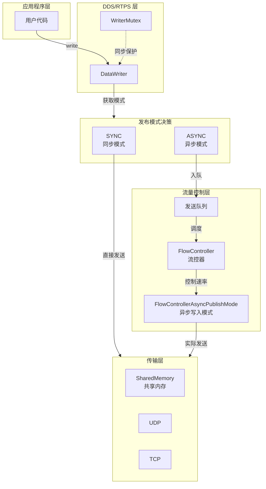
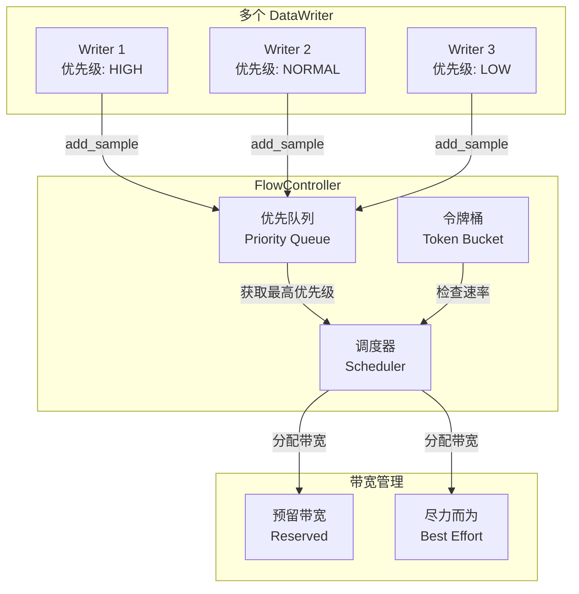

# Fast-DDS 流量控制（Flow Control）详解

> 📌 **代码来源说明**：本文中的代码示例分为两类：
> 1. **实际源码**：来自 [Fast-DDS 官方仓库](https://github.com/eProsima/Fast-DDS)，链接已标注
> 2. **简化示例**：为教学目的简化，省略了锁、异常处理等细节
>
> **重要更正**：文中使用的 `AsyncWriterThread` 是**概念性命名**，实际源码中的对应实现为 `FlowControllerAsyncPublishMode`，位于 `src/cpp/rtps/flowcontrol/FlowControllerImpl.hpp`

---

## 目录
1. [流量控制概述](#1-流量控制概述)
2. [核心概念与架构](#2-核心概念与架构)
3. [PublishMode（发布模式）](#3-publishmode发布模式)
4. [FlowController（流控器）](#4-flowcontroller流控器)
5. [FlowControllerAsyncPublishMode（异步写入）](#5-flowcontrollerasyncpublishmode异步写入)
6. [源码解析](#6-源码解析)
7. [配置与调优](#7-配置与调优)
8. [实战示例](#8-实战示例)
9. [常见问题](#9-常见问题)

---

## 1. 流量控制概述

### 1.1 为什么需要流量控制？

在 DDS/RTPS 系统中，流量控制解决以下核心问题：

```
┌─────────────────────────────────────────────────────────────────┐
│                      流量控制要解决的问题                        │
├─────────────────────────────────────────────────────────────────┤
│                                                                  │
│  问题1: 发送速率 > 接收速率                                       │
│  ┌─────────┐    1000 msg/s    ┌─────────┐                      │
│  │ Writer  │  ───────────────→ │ Reader  │ 只能处理 100 msg/s   │
│  └─────────┘                   └─────────┘                      │
│                       ↓                                         │
│              数据堆积 → 内存溢出 → 丢包                          │
│                                                                  │
│  问题2: 突发流量 (Bursty Traffic)                                │
│  ┌─────────┐                                                   │
│  │ Writer  │  ▲▲▲ 突发发送 ▲▲▲                                 │
│  └─────────┘   ↓                                               │
│         网络拥塞 → 延迟抖动 → 服务质量下降                        │
│                                                                  │
│  问题3: 多 Writer 竞争带宽                                        │
│  ┌─────┐ ┌─────┐ ┌─────┐                                       │
│  │ W1  │ │ W2  │ │ W3  │  同时发送 → 带宽竞争 → 公平性问题       │
│  └─────┘ └─────┘ └─────┘                                       │
│                                                                  │
└─────────────────────────────────────────────────────────────────┘
```

### 1.2 Fast-DDS 流量控制策略

Fast-DDS 提供两层流量控制机制：

| 层级 | 机制 | 作用 | 配置方式 |
|------|------|------|----------|
| **Writer 层** | PublishMode | 控制写入模式（同步/异步） | DataWriterQos |
| **Network 层** | FlowController | 控制网络发送速率 | PropertyPolicyQos |

---

## 2. 核心概念与架构

### 2.1 整体架构图



### 2.2 关键类关系

```cpp
// 核心类层次结构

DataWriter
├── PublisherModeQosPolicy    // 发布模式配置 (SYNC/ASYNC)
├── FlowController            // 流控器
│   ├── FlowControllerDescriptor  // 流控器描述
│   ├── ReservationToken      // 预留令牌
│   └── Schedules             // 调度策略
└── FlowControllerAsyncPublishMode         // 异步写入线程 (全局)

// 相关 QoS 策略
DataWriterQos
├── publish_mode              // 发布模式
├── throughput_controller     // 吞吐量控制器 (旧版)
└── data_sharing              // 数据共享配置
```

---

## 3. PublishMode（发布模式）

### 3.1 两种发布模式

```cpp
// include/fastdds/dds/core/policy/QosPolicies.hpp

enum class PublishModeQosPolicyKind : uint8_t
{
    SYNCHRONOUS,    // 同步模式 - write() 直接发送
    ASYNCHRONOUS    // 异步模式 - write() 入队，后台线程发送
};

class PublishModeQosPolicy : public QosPolicy
{
public:
    PublishModeQosPolicyKind kind = PublishModeQosPolicyKind::SYNCHRONOUS;
    std::string flow_controller_name;  // 关联的流控器名称
    // ...
};
```

### 3.2 同步模式（SYNCHRONOUS）

```
┌─────────────────────────────────────────────────────────────┐
│                    同步模式数据流                            │
├─────────────────────────────────────────────────────────────┤
│                                                              │
│  用户线程                                                    │
│     │                                                        │
│     ▼                                                        │
│  write(data) ───────────────────────────────────────────────┐│
│     │                                                       ││
│     ▼                                                       ││
│  ┌──────────────────────────────────────────────────────┐  ││
│  │  DataWriter::write()                                 │  ││
│  │  ├── 序列化数据                                      │  ││
│  │  ├── 添加到 HistoryCache                            │  ││
│  │  └── 直接调用 Transport 发送                        │  ││
│  │       ↓                                              │  ││
│  │  阻塞直到：                                          │  ││
│  │  • 数据写入传输层 (UDP/TCP/SHM)                      │  ││
│  │  • 或发送缓冲区已满 (Reliability QoS下)             │  ││
│  └──────────────────────────────────────────────────────┘  ││
│     │                                                       ││
│     ▼                                                       ││
│  write() 返回 ─────────────────────────────────────────────┘│
│     │                                                        │
│     ▼                                                        │
│  用户线程继续执行                                             │
│                                                              │
└─────────────────────────────────────────────────────────────┘
```

**特点**：
- ✅ 简单直观，调用即发送
- ✅ 低延迟（没有队列延迟）
- ❌ 阻塞用户线程
- ❌ 突发流量可能导致发送阻塞

### 3.3 异步模式（ASYNCHRONOUS）

```
┌─────────────────────────────────────────────────────────────────────────┐
│                         异步模式数据流                                   │
├─────────────────────────────────────────────────────────────────────────┤
│                                                                          │
│  用户线程                          FlowControllerAsyncPublishMode                    │
│     │                                    │                              │
│     ▼                                    ▼                              │
│  write(data) ─────────────────────────────────────────────────────────┐│
│     │                                                                 ││
│     ▼                                                                 ││
│  ┌──────────────────────────────────────────────────────┐            ││
│  │  DataWriter::write()                                 │            ││
│  │  ├── 序列化数据                                      │            ││
│  │  ├── 添加到 HistoryCache                            │            ││
│  │  └── 添加到 FlowController 队列                     │ ────────────┤│
│  │       ↓                                              │    唤醒    ││
│  └──────────────────────────────────────────────────────┘            ││
│     │                                                                  ││
│     ▼                                                                  ││
│  write() 立即返回 ────────────────────────────────────────────────────┘│
│     │                                                                   │
│     ▼                                                                   │
│  用户线程继续执行                                                        │
│                                                                          │
│                                    调度流程：                            │
│                                    ┌─────────────────────────────┐      │
│                                    │ 1. FlowController 获取令牌   │      │
│                                    │ 2. 检查带宽限制              │      │
│                                    │ 3. 实际发送数据              │      │
│                                    │ 4. 更新统计信息              │      │
│                                    │ 5. 释放令牌                  │      │
│                                    └─────────────────────────────┘      │
│                                                                          │
└─────────────────────────────────────────────────────────────────────────┘
```

**特点**：
- ✅ 非阻塞，write() 立即返回
- ✅ 支持流量整形（Traffic Shaping）
- ✅ 批量发送优化
- ❌ 引入队列延迟
- ❌ 增加系统复杂度

### 3.4 模式选择指南

| 场景 | 推荐模式 | 理由 |
|------|---------|------|
| 低延迟要求 < 1ms | SYNC | 避免队列延迟 |
| 高吞吐 > 10K msg/s | ASYNC | 批量发送优化 |
| 突发流量 | ASYNC | 流量整形 |
| 多 Writer 公平性 | ASYNC | FlowController 调度 |
| 简单应用 | SYNC | 配置简单 |

---

## 4. FlowController（流控器）

### 4.1 FlowController 概述

FlowController 是异步模式下的核心组件，负责：
1. **速率限制**：控制数据发送速率
2. **优先级调度**：多 Writer 间的公平调度
3. **流量整形**：平滑突发流量

```cpp
// include/fastdds/rtps/flowcontrol/FlowController.hpp

class FlowController
{
public:
    // 添加数据到流控队列
    bool add_new_sample(
        RTPSWriter* writer,
        CacheChange_t* change,
        const std::chrono::time_point<std::chrono::steady_clock>& max_blocking_time);

    // 获取下一个要发送的数据
    FlowControllerAction get_next_sample(
        RTPSWriter*& writer,
        CacheChange_t*& change,
        std::chrono::time_point<std::chrono::steady_clock>& next_wake_up_time);

    // 配置流控器
    void configure(const FlowControllerDescriptor& descriptor);

private:
    FlowControllerImpl* impl_;  // PIMPL 实现
};
```

### 4.2 FlowController 类型

Fast-DDS 内置三种流控器：

```cpp
// 默认流控器 - 无限制
constexpr const char* FASTDDS_FLOW_CONTROLLER_DEFAULT = "FastDDSFlowControllerDefault";

// 推荐流控器 - 基于令牌的速率限制
constexpr const char* FASTDDS_FLOW_CONTROLLER_FIXED_RATE = "FastDDSFlowControllerFixedRate";

// 预留流控器 - 预留带宽 + 尽力而为
constexpr const char* FASTDDS_FLOW_CONTROLLER_RESERVED_BANDWIDTH = "FastDDSFlowControllerReservedBandwidth";
```

### 4.3 流控器架构



### 4.4 令牌桶算法

```cpp
// 令牌桶算法原理

class TokenBucket
{
    float tokens_;              // 当前令牌数
    float max_tokens_;          // 桶容量
    float tokens_per_period_;   // 每个周期产生的令牌数
    std::chrono::nanoseconds period_;  // 周期
    std::chrono::steady_clock::time_point last_add_time_;

public:
    // 尝试消耗 n 个令牌
    bool consume(uint32_t n)
    {
        // 1. 根据时间补充令牌
        auto now = std::chrono::steady_clock::now();
        auto elapsed = now - last_add_time_;
        float new_tokens = elapsed.count() * tokens_per_period_ / period_.count();
        tokens_ = std::min(tokens_ + new_tokens, max_tokens_);
        last_add_time_ = now;

        // 2. 检查并消耗令牌
        if (tokens_ >= n) {
            tokens_ -= n;
            return true;  // 允许发送
        }
        return false;  // 需要等待
    }

    // 计算下次可用时间
    std::chrono::nanoseconds time_until_available(uint32_t n)
    {
        float needed = n - tokens_;
        return std::chrono::nanoseconds(
            static_cast<int64_t>(needed * period_.count() / tokens_per_period_));
    }
};
```

**工作流程**：
```
初始状态: 桶满 (max_tokens = 1000)
          
Writer 请求发送 100 bytes:
    │
    ▼
检查令牌: 1000 >= 100 ✓
    │
    ▼
消耗令牌: tokens = 900
    │
    ▼
允许发送

连续发送后:
    tokens = 50 (< 100)
    │
    ▼
请求发送 100 bytes:
    │
    ▼
检查令牌: 50 < 100 ✗
    │
    ▼
计算等待时间: 需要 50 个令牌
    time = 50ms (假设 1000 tokens/s)
    │
    ▼
阻塞/等待
```

---

## 5. FlowControllerAsyncPublishMode（异步写入线程）

### 5.1 线程模型

```cpp
// src/cpp/rtps/writer/FlowControllerAsyncPublishMode.cpp

class FlowControllerAsyncPublishMode
{
public:
    // 启动异步写入线程
    static bool start();

    // 停止异步写入线程
    static bool stop();

    // 将 Writer 添加到调度
    static bool add_writer(RTPSWriter* writer);

    // 从调度中移除 Writer
    static bool remove_writer(RTPSWriter* writer);

private:
    static void run();  // 主循环

    struct FlowControllerAsyncPublishModeState
    {
        std::thread thread_;           // 工作线程
        std::mutex mutex_;             // 保护 writers_ 集合
        std::condition_variable cv_;   // 等待/唤醒
        std::unordered_set<RTPSWriter*> writers_;  // 待调度的 Writers
        bool running_ = false;
    };

    static FlowControllerAsyncPublishModeState s_state_;
};
```

### 5.2 主循环流程

```
┌─────────────────────────────────────────────────────────────────┐
│                   FlowControllerAsyncPublishMode::run()                       │
└─────────────────────────────────────────────────────────────────┘
                           │
                           ▼
                    ┌─────────────┐
                    │   启动      │
                    └─────────────┘
                           │
                           ▼
            ┌──────────────────────────┐
       ┌───│  while (running_)         │
       │   └──────────────────────────┘
       │              │
       │              ▼
       │   ┌──────────────────────┐
       │   │ 1. 遍历所有 Writers   │
       │   │    - 检查 FlowControl │
       │   │    - 获取可发送数据   │
       │   └──────────────────────┘
       │              │
       │              ▼
       │   ┌──────────────────────┐
       │   │ 2. 发送数据          │
       │   │    - 调用 Transport   │
       │   │    - 更新统计         │
       │   └──────────────────────┘
       │              │
       │              ▼
       │   ┌──────────────────────┐
       │   │ 3. 计算下次唤醒时间  │
       │   │    - 根据令牌桶      │
       │   │    - 根据队列状态    │
       │   └──────────────────────┘
       │              │
       │              ▼
       │   ┌──────────────────────┐
       └──→│ 4. 等待或继续        │
           │    - cv_.wait_until() │
           └──────────────────────┘
```

### 5.3 唤醒机制

```cpp
// 何时唤醒 FlowControllerAsyncPublishMode？

void FlowControllerAsyncPublishMode::wake_up()
{
    std::lock_guard<std::mutex> lock(s_state_.mutex_);
    s_state_.cv_.notify_one();  // 唤醒线程
}

// 触发场景：
// 1. 新数据写入 (DataWriter::write())
// 2. 令牌桶补充令牌 (定时)
// 3. 网络可用 (发送完成回调)
// 4. 外部配置变更
```

---

## 6. 源码解析

### 6.1 DataWriter 写入流程

```cpp
// src/cpp/fastdds/publisher/DataWriterImpl.cpp

ReturnCode_t DataWriterImpl::write(void* data)
{
    // 1. 序列化数据
    CacheChange_t* change = create_new_change(data);

    // 2. 根据 PublishMode 决定发送方式
    if (qos_.publish_mode().kind == SYNCHRONOUS)
    {
        // 同步模式：直接发送
        return rtps_writer_->write(change);
    }
    else  // ASYNCHRONOUS
    {
        // 异步模式：添加到 FlowController
        FlowController* fc = get_flow_controller();
        return fc->add_new_sample(
            rtps_writer_,
            change,
            max_blocking_time);
    }
}
```

### 6.2 FlowController 调度实现

```cpp
// src/cpp/rtps/flowcontrol/FlowControllerImpl.hpp

class FlowControllerImpl
{
public:
    FlowControllerAction schedule(
        std::chrono::time_point<std::chrono::steady_clock>& next_wake_up_time)
    {
        // 1. 按优先级遍历所有 Writers
        for (auto& writer_info : writers_)
        {
            // 2. 检查是否满足发送条件
            if (!can_send(writer_info))
                continue;

            // 3. 检查令牌桶
            uint32_t size = writer_info.change->serializedPayload.length;
            if (token_bucket_.consume(size))
            {
                // 4. 可以发送
                next_writer_ = writer_info.writer;
                next_change_ = writer_info.change;
                return FlowControllerAction::SEND;
            }
            else
            {
                // 5. 计算下次可用时间
                auto wait_time = token_bucket_.time_until_available(size);
                next_wake_up_time = std::min(next_wake_up_time,
                    std::chrono::steady_clock::now() + wait_time);
            }
        }

        return FlowControllerAction::NO_ACTION;
    }
};
```

### 6.3 FlowControllerAsyncPublishMode 主循环

```cpp
// src/cpp/rtps/writer/FlowControllerAsyncPublishMode.cpp

void FlowControllerAsyncPublishMode::run()
{
    while (s_state_.running_)
    {
        std::unique_lock<std::mutex> lock(s_state_.mutex_);

        // 1. 遍历所有 Writers 进行调度
        auto next_wakeup = std::chrono::steady_clock::now() +
                          std::chrono::milliseconds(100);

        for (RTPSWriter* writer : s_state_.writers_)
        {
            FlowController* fc = writer->get_flow_controller();
            RTPSWriter* w = nullptr;
            CacheChange_t* change = nullptr;

            // 2. 获取下一个要发送的数据
            auto action = fc->get_next_sample(w, change, next_wakeup);

            if (action == FlowControllerAction::SEND)
            {
                // 3. 解锁后发送（避免持有锁时进行网络IO）
                lock.unlock();
                writer->send(change);
                lock.lock();
            }
        }

        // 4. 等待直到下次调度时间
        s_state_.cv_.wait_until(lock, next_wakeup);
    }
}
```

---

## 7. 配置与调优

### 7.1 配置 PublishMode

```cpp
#include <fastdds/dds/domain/DomainParticipantFactory.hpp>
#include <fastdds/dds/publisher/DataWriter.hpp>
#include <fastdds/dds/publisher/qos/DataWriterQos.hpp>

using namespace eprosima::fastdds::dds;

// 方法1: XML 配置（推荐用于生产环境）
/*
<data_writer profile_name="async_writer">
    <qos>
        <publishMode>
            <kind>ASYNCHRONOUS</kind>
            <flowControllerName>FastDDSFlowControllerFixedRate</flowControllerName>
        </publishMode>
    </qos>
</data_writer>
*/

// 方法2: 代码配置
void configure_async_writer()
{
    DataWriterQos qos;

    // 设置为异步模式
    qos.publish_mode().kind = ASYNCHRONOUS;

    // 指定流控器（可选，默认使用 FastDDSFlowControllerDefault）
    qos.publish_mode().flow_controller_name = "FastDDSFlowControllerFixedRate";

    // 创建 DataWriter
    DataWriter* writer = publisher->create_datawriter(topic, qos);
}
```

### 7.2 配置 FlowController

```cpp
#include <fastdds/rtps/attributes/PropertyPolicyQos.hpp>

void configure_flow_controller()
{
    // 方式1: 使用内置流控器（最简单）
    DataWriterQos qos;
    qos.publish_mode().kind = ASYNCHRONOUS;
    qos.publish_mode().flow_controller_name = "FastDDSFlowControllerFixedRate";

    // 方式2: 自定义流控器（XML配置）
    /*
    <flow_controller name="my_custom_controller">
        <max_bytes_per_period>10000</max_bytes_per_period>
        <period_ms>100</period_ms>
        <scheduler>FIFO</scheduler>
    </flow_controller>
    */

    // 方式3: 通过 PropertyPolicyQos 配置（代码方式）
    PropertyPolicyQos properties;

    // 配置最大发送速率: 10KB/s
    properties.properties().emplace_back(
        "fastdds.flow_controller.max_bytes_per_period",
        "10000"  // 10000 bytes per period
    );

    // 配置周期: 100ms
    properties.properties().emplace_back(
        "fastdds.flow_controller.period_ms",
        "100"
    );

    // 应用配置
    qos.properties() = properties;
}
```

### 7.3 关键参数调优指南

| 参数 | 说明 | 默认值 | 调优建议 |
|------|------|--------|----------|
| `max_bytes_per_period` | 每周期最大发送字节数 | 无限 | 根据带宽限制设置 |
| `period_ms` | 令牌补充周期 | 100ms | 越小越平滑，但CPU开销增加 |
| `scheduler` | 调度策略 | FIFO | 优先级敏感场景用 PRIORITY |

**计算示例**：

```
目标: 限制发送速率为 1 MB/s

计算:
    period_ms = 100ms = 0.1s
    max_bytes_per_period = 1MB/s × 0.1s = 100KB = 102400 bytes

配置:
    max_bytes_per_period = 102400
    period_ms = 100
```

### 7.4 多 Writer 优先级配置

```cpp
// 为不同重要性的数据配置不同优先级

// 关键数据 - 高优先级
DataWriterQos critical_qos;
critical_qos.publish_mode().kind = ASYNCHRONOUS;
critical_qos.publish_mode().flow_controller_name = "high_priority_fc";

// 普通数据 - 默认优先级
DataWriterQos normal_qos;
normal_qos.publish_mode().kind = ASYNCHRONOUS;
normal_qos.publish_mode().flow_controller_name = "FastDDSFlowControllerDefault";

// 后台数据 - 低优先级
DataWriterQos background_qos;
background_qos.publish_mode().kind = ASYNCHRONOUS;
background_qos.publish_mode().flow_controller_name = "low_priority_fc";
```

---

## 8. 实战示例

### 8.1 示例1: 视频流流量控制

```cpp
// 场景: 发送 1080p 视频流，限制带宽不超过 4Mbps

void setup_video_stream_writer()
{
    DataWriterQos qos;

    // 视频流适合异步模式（数据量大，允许延迟）
    qos.publish_mode().kind = ASYNCHRONOUS;
    qos.publish_mode().flow_controller_name = "FastDDSFlowControllerFixedRate";

    // 计算: 4Mbps = 4,000,000 bits/s = 500,000 bytes/s
    // 周期 100ms，则每周期 50,000 bytes
    PropertyPolicyQos properties;
    properties.properties().emplace_back(
        "fastdds.flow_controller.max_bytes_per_period",
        "50000"
    );
    properties.properties().emplace_back(
        "fastdds.flow_controller.period_ms",
        "100"
    );
    qos.properties() = properties;

    // 其他 QoS 优化
    qos.reliability().kind = BEST_EFFORT;  // 视频允许丢帧
    qos.history().kind = KEEP_LAST;
    qos.history().depth = 1;  // 只保留最新帧

    DataWriter* video_writer = publisher->create_datawriter(video_topic, qos);
}
```

### 8.2 示例2: 多优先级消息系统

```cpp
// 场景: 控制系统，包含告警、状态、日志三种消息

void setup_control_system()
{
    // === 告警消息 - 最高优先级 ===
    DataWriterQos alarm_qos;
    alarm_qos.publish_mode().kind = ASYNCHRONOUS;
    // 不限制速率，确保告警及时送达
    alarm_qos.publish_mode().flow_controller_name = "FastDDSFlowControllerDefault";
    alarm_qos.reliability().kind = RELIABLE;
    alarm_qos.durability().kind = TRANSIENT_LOCAL;
    DataWriter* alarm_writer = publisher->create_datawriter(alarm_topic, alarm_qos);

    // === 状态消息 - 中等优先级，限速 ===
    DataWriterQos status_qos;
    status_qos.publish_mode().kind = ASYNCHRONOUS;
    status_qos.publish_mode().flow_controller_name = "FastDDSFlowControllerFixedRate";
    // 100 msg/s * 100 bytes/msg = 10KB/s
    PropertyPolicyQos status_props;
    status_props.properties().emplace_back(
        "fastdds.flow_controller.max_bytes_per_period", "1000"
    );
    status_props.properties().emplace_back(
        "fastdds.flow_controller.period_ms", "100"
    );
    status_qos.properties() = status_props;
    DataWriter* status_writer = publisher->create_datawriter(status_topic, status_qos);

    // === 日志消息 - 低优先级，严格限速 ===
    DataWriterQos log_qos;
    log_qos.publish_mode().kind = ASYNCHRONOUS;
    log_qos.publish_mode().flow_controller_name = "FastDDSFlowControllerFixedRate";
    // 10 msg/s，避免占用太多带宽
    PropertyPolicyQos log_props;
    log_props.properties().emplace_back(
        "fastdds.flow_controller.max_bytes_per_period", "1000"
    );
    log_props.properties().emplace_back(
        "fastdds.flow_controller.period_ms", "1000"  // 1秒周期
    );
    log_qos.properties() = log_props;
    DataWriter* log_writer = publisher->create_datawriter(log_topic, log_qos);
}
```

### 8.3 示例3: 突发流量整形

```cpp
// 场景: 传感器周期性批量上报，需要平滑流量

void setup_sensor_writer()
{
    DataWriterQos qos;

    // 传感器数据适合异步 + 流控
    qos.publish_mode().kind = ASYNCHRONOUS;
    qos.publish_mode().flow_controller_name = "FastDDSFlowControllerFixedRate";

    // 配置较大的令牌桶，允许小突发
    PropertyPolicyQos properties;
    properties.properties().emplace_back(
        "fastdds.flow_controller.max_bytes_per_period",
        "50000"  // 50KB 每 100ms
    );
    properties.properties().emplace_back(
        "fastdds.flow_controller.period_ms",
        "100"
    );
    qos.properties() = properties;

    // 配合 History QoS 处理突发
    qos.history().kind = KEEP_ALL;  // 保留所有数据直到发送
    qos.resource_limits().max_samples = 1000;  // 限制队列大小

    DataWriter* sensor_writer = publisher->create_datawriter(sensor_topic, qos);
}
```

---

## 9. 常见问题

### Q1: 异步模式下，write() 会阻塞吗？

**答**: 可能阻塞，取决于配置：

```cpp
// max_blocking_time 参数控制最大阻塞时间
ReturnCode_t write(void* data,
    WriteParams& params,
    const std::chrono::steady_clock::duration& max_blocking_time);

// 场景:
// 1. 队列已满 -> 阻塞直到有空间或超时
// 2. 流控限制 -> 阻塞直到获得令牌或超时
// 3. 配置为非阻塞 -> 立即返回 OUT_OF_RESOURCES
```

### Q2: 同步模式和异步模式的性能差异？

| 指标 | SYNC | ASYNC |
|------|------|-------|
| 延迟 | 低（直接发送） | 高（队列延迟） |
| 吞吐 | 受限于应用线程 | 可批量优化 |
| CPU | 低 | 高（额外线程） |
| 流控 | 不支持 | 支持 |

### Q3: 如何监控流控效果？

```cpp
// 通过 Listener 监控
class MyWriterListener : public DataWriterListener
{
public:
    void on_offered_incompatible_qos(
        DataWriter* writer,
        const OfferedIncompatibleQosStatus& status) override
    {
        // QoS 不兼容时触发
    }

    void on_publication_matched(
        DataWriter* writer,
        const PublicationMatchedStatus& status) override
    {
        // 匹配状态变化时触发
    }
};

// 监控队列深度（自定义统计）
class FlowControlMonitor
{
public:
    void check_queue_depth(RTPSWriter* writer)
    {
        // 获取历史缓存大小
        size_t unsent = writer->get_unsent_changes().size();

        if (unsent > high_watermark_) {
            // 队列积压，可能需要调整流控参数
        }
    }
};
```

### Q4: 流控器可以动态调整吗？

**答**: Fast-DDS 2.x 版本不支持运行时动态调整流控器参数。需要：
1. 销毁旧的 DataWriter
2. 修改 QoS 配置
3. 创建新的 DataWriter

或者通过自定义流控器实现动态调整逻辑。

### Q5: 多个 DataWriter 共享同一个 FlowController 吗？

**答**: 取决于配置：

```cpp
// 默认情况下，每个 Writer 使用自己的流控器实例
// 同名流控器会共享同一个控制器

// Writer 1 和 Writer 2 共享流控器
qos1.publish_mode().flow_controller_name = "shared_controller";
qos2.publish_mode().flow_controller_name = "shared_controller";

// Writer 3 使用独立流控器
qos3.publish_mode().flow_controller_name = "FastDDSFlowControllerDefault";
```

---

## 总结

```
┌─────────────────────────────────────────────────────────────────┐
│                      流量控制要点回顾                            │
├─────────────────────────────────────────────────────────────────┤
│                                                                  │
│  1. PublishMode                                                 │
│     • SYNC: 直接发送，低延迟，简单                               │
│     • ASYNC: 队列缓冲，支持流控，适合高吞吐                       │
│                                                                  │
│  2. FlowController                                              │
│     • 基于令牌桶算法                                             │
│     • 支持速率限制和优先级调度                                    │
│     • 内置三种类型: Default/FixedRate/ReservedBandwidth          │
│                                                                  │
│  3. FlowControllerAsyncPublishMode                                           │
│     • 全局单线程调度所有异步 Writer                              │
│     • 条件变量实现高效唤醒                                       │
│                                                                  │
│  4. 使用场景                                                    │
│     • 视频流: ASYNC + 固定速率                                   │
│     • 多优先级: 不同 Writer 使用不同流控器                       │
│     • 突发流量: 大令牌桶 + History KEEP_ALL                      │
│                                                                  │
└─────────────────────────────────────────────────────────────────┘
```

---

*文档版本: 1.0*  
*基于 Fast-DDS 2.14.x 版本源码分析*
