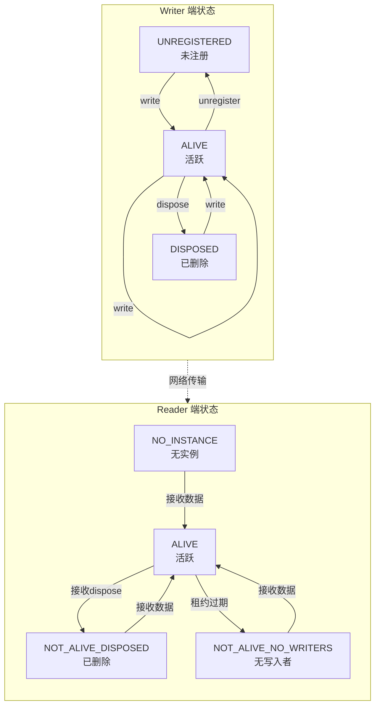

# DDS Instance Management（实例管理）详解

## 目录
1. [Instance 概念与核心原理](#1-instance-概念与核心原理)
2. [Instance 的生命周期](#2-instance-的生命周期)
3. [Key 的定义与作用](#3-key-的定义与作用)
4. [三种 State 详解](#4-三种-state-详解)
5. [源码实现分析](#5-源码实现分析)
6. [Reader 端的 Instance 管理](#6-reader-端的-instance-管理)
7. [实战示例](#7-实战示例)
8. [最佳实践](#8-最佳实践)

---

## 1. Instance 概念与核心原理

### 1.1 什么是 Instance？

在 DDS 中，**Instance** 是由 **Key** 标识的一组相关数据样本的集合。它是 DDS 区别于普通 Pub/Sub 系统的核心概念。

```
┌─────────────────────────────────────────────────────────────────┐
│                      DDS Instance 概念                          │
├─────────────────────────────────────────────────────────────────┤
│                                                                  │
│  传统 Pub/Sub (无 Instance):                                    │
│  ┌─────────┐      Topic: "Temperature"      ┌─────────┐        │
│  │ Writer  │  ───────────────────────────→  │ Reader  │        │
│  └─────────┘                                └─────────┘        │
│       │ 25°C                                          25°C      │
│       │ 26°C                                          26°C      │
│       │ 27°C                                          27°C      │
│       └─→ 只是连续的数据流，无法区分是哪个传感器               │
│                                                                  │
│  DDS (有 Instance):                                             │
│  ┌─────────┐      Topic: "Temperature"      ┌─────────┐        │
│  │ Writer  │  ───────────────────────────→  │ Reader  │        │
│  └─────────┘                                └─────────┘        │
│       │                                                          │
│       ├─ Instance A (sensor_id=1): 25°C, 26°C, 27°C...         │
│       ├─ Instance B (sensor_id=2): 30°C, 31°C, 32°C...         │
│       └─ Instance C (sensor_id=3): 20°C, 21°C, 22°C...         │
│           ↑                                                      │
│           └── Key = sensor_id，区分不同数据源                   │
│                                                                  │
└─────────────────────────────────────────────────────────────────┘
```

### 1.2 为什么需要 Instance？

```cpp
// 场景：追踪多个目标的位置

// 不用 Instance（笨拙做法）
struct TargetPosition {
    string target_id;  // 需要手动携带ID
    double x, y, z;
};
// 问题：Reader 无法自动知道目标何时消失

// 用 Instance（DDS 原生支持）
struct TargetPosition {
    @key string target_id;  // Key 定义 Instance
    double x, y, z;
};
// 优势：
// 1. DDS 自动管理每个目标的生命周期
// 2. 支持 Instance 级别的通知（目标出现/消失）
// 3. 可以独立追踪每个目标的状态
```

### 1.3 Instance vs Sample

| 概念 | 含义 | 类比 |
|------|------|------|
| **Instance** | 由 Key 标识的实体 | 一个传感器、一个用户、一个目标 |
| **Sample** | 某个时间点 Instance 的数据值 | 一次温度读数、一次位置更新 |

```
Instance (目标A, key="A"):
├── Sample 1: {time=t1, x=100, y=200}
├── Sample 2: {time=t2, x=105, y=205}
├── Sample 3: {time=t3, x=110, y=210}
└── ...

Instance (目标B, key="B"):
├── Sample 1: {time=t1, x=300, y=400}
├── Sample 2: {time=t2, x=305, y=405}
└── ...
```

---

## 2. Instance 的生命周期

### 2.1 生命周期状态图



### 2.2 Writer 端操作

```cpp
// 1. 隐式注册（写入时自动注册）
DataWriter* writer;
TargetPosition pos;
pos.target_id = "Target_A";  // key
pos.x = 100; pos.y = 200;
writer->write(&pos);  // 自动创建 Instance

// 2. 显式注册（获取 handle 用于后续操作）
TargetPosition key_holder;
key_holder.target_id = "Target_A";
InstanceHandle_t handle = writer->register_instance(&key_holder);

// 3. 使用 handle 写入
writer->write(&pos, handle);

// 4. 标记实例为"已删除"（生命周期结束）
writer->dispose(handle);
// 等价于: writer->write(&pos, handle, DISPOSE);

// 5. 注销实例（不再关注）
writer->unregister_instance(handle);
```

### 2.3 ChangeKind_t：样本的生命周期语义

```cpp
// include/fastdds/rtps/common/CacheChange.h

enum ChangeKind_t {
    ALIVE,                          // 正常数据样本
    NOT_ALIVE_DISPOSED,             // 实例被显式删除 (dispose)
    NOT_ALIVE_UNREGISTERED,         // 实例被注销 (unregister)
    NOT_ALIVE_DISPOSED_UNREGISTERED // 既删除又注销
};
```

```
┌─────────────────────────────────────────────────────────────────┐
│                      ChangeKind 语义                            │
├─────────────────────────────────────────────────────────────────┤
│                                                                  │
│  ALIVE                                                          │
│  ├── 含义: "这是某个 Instance 的新数据"                         │
│  ├── 场景: write() 正常写入                                     │
│  └── Reader: 更新实例状态为 ALIVE                               │
│                                                                  │
│  NOT_ALIVE_DISPOSED                                             │
│  ├── 含义: "这个 Instance 被逻辑删除了"                         │
│  ├── 场景: dispose() 或带 key 的写操作标记删除                  │
│  ├── 语义: "目标已摧毁"、"用户已下线"、"订单已完成"            │
│  └── Reader: 更新实例状态，触发 on_data_available()             │
│                                                                  │
│  NOT_ALIVE_UNREGISTERED                                         │
│  ├── 含义: "Writer 不再关注这个 Instance"                       │
│  ├── 场景: unregister_instance()                                │
│  ├── 语义: "我停止追踪这个目标"                                 │
│  └── Reader: 实例状态变为 NO_WRITERS                            │
│                                                                  │
└─────────────────────────────────────────────────────────────────┘
```

---

## 3. Key 的定义与作用

### 3.1 Key 的定义方式

```cpp
// === 方式1: IDL 中使用 @key 注解 ===
// File: Target.idl

struct TargetPosition {
    @key string target_id;  // key 字段
    double x;
    double y;
    double z;
};

// === 方式2: C++ 代码中使用 @key 宏 ===
#include <fastdds/dds/core/annotations.hpp>

struct TargetPosition {
    eprosima::fastdds::dds::key string target_id;
    double x, y, z;
};

// === 方式3: 多字段组成复合 Key ===
struct SensorReading {
    @key string sensor_type;   // 传感器类型
    @key int32_t sensor_id;    // 传感器ID
    double value;
    timestamp time;
};
// Instance = (sensor_type, sensor_id) 的组合
```

### 3.2 InstanceHandle_t

```cpp
// include/fastdds/rtps/common/InstanceHandle.h

struct InstanceHandle_t {
    octet value[16];  // 128-bit GUID

    // 从 Key 计算 handle
    static InstanceHandle_t compute_key(const void* data, TopicDescription* topic);

    // 特殊值
    static const InstanceHandle_t c_InstanceHandle_Unknown;  // 未知实例
    static const InstanceHandle_t c_InstanceHandle_All;      // 所有实例
};
```

```
┌─────────────────────────────────────────────────────────────────┐
│                  InstanceHandle 计算过程                        │
├─────────────────────────────────────────────────────────────────┤
│                                                                  │
│  输入: Data Sample                                               │
│  ┌─────────────────────────────────────────┐                    │
│  │ target_id = "Target_A"                  │  ← key 字段        │
│  │ x = 100.0                               │                    │
│  │ y = 200.0                               │                    │
│  │ z = 50.0                                │                    │
│  └─────────────────────────────────────────┘                    │
│       │                                                          │
│       ▼                                                          │
│  提取 Key 字段 (target_id = "Target_A")                          │
│       │                                                          │
│       ▼                                                          │
│  MD5/SHA 哈希 (128-bit)                                          │
│       │                                                          │
│       ▼                                                          │
│  InstanceHandle_t: {0xA1, 0xB2, 0xC3, ...} (16 bytes)           │
│                                                                  │
│  注意: 相同 Key 的数据 → 相同的 Handle                           │
│                                                                  │
└─────────────────────────────────────────────────────────────────┘
```

### 3.3 Keyed vs Keyless Topic

```cpp
// === Keyed Topic ===
struct Temperature {
    @key string sensor_id;  // 有 @key
    double value;
};
// 特性:
// - 支持多个 Instance (每个 sensor_id 是一个实例)
// - 支持 Instance 生命周期管理
// - Reader 可以独立追踪每个 sensor

// === Keyless Topic ===
struct SystemStatus {
    double cpu_usage;    // 没有 @key
    double memory_usage;
};
// 特性:
// - 只有一个隐式 Instance (handle = 0)
// - 不支持 Instance 生命周期管理
// - 就是普通的 Pub/Sub 语义
```

| 特性 | Keyed Topic | Keyless Topic |
|------|-------------|---------------|
| Instance 数量 | 多个 | 1 个（隐式） |
| dispose() | 支持 | 无意义 |
| register_instance() | 支持 | 无意义 |
| Instance State | 支持 | 固定 ALIVE |
| 适用场景 | 多目标追踪 | 单流数据 |

---

## 4. 三种 State 详解

DDS 定义了三种与 Instance 相关的状态，都在 **SampleInfo** 结构中：

### 4.1 SampleState：样本读取状态

```cpp
// 表示某个样本是否被读取过

enum SampleStateKind {
    READ,       // 样本已经被 read/take 过
    NOT_READ    // 样本未被读取（新数据）
};
```

```
Reader History:
┌─────┬──────────┬─────────────┐
│ Seq │ Data     │ SampleState │
├─────┼──────────┼─────────────┤
│ 100 │ 25°C     │ READ        │ ← 之前读取过
│ 101 │ 26°C     │ READ        │ ← 之前读取过
│ 102 │ 27°C     │ NOT_READ    │ ← 新数据，未读取
└─────┴──────────┴─────────────┘
```

### 4.2 ViewState：实例视图状态

```cpp
// 表示某个 Instance 是否是第一次出现

enum ViewStateKind {
    NEW,        // 这个 Instance 是第一次出现（或者重生）
    NOT_NEW     // 这个 Instance 之前已经存在
};
```

```
场景：追踪多个目标

Time 0: 读取 Instance A
┌─────┬──────────┬───────────┐
│ Ins │ Data     │ ViewState │
├─────┼──────────┼───────────┤
│ A   │ pos1     │ NEW       │ ← 第一次出现
└─────┴──────────┴───────────┘

Time 1: 再次读取 Instance A
┌─────┬──────────┬───────────┐
│ Ins │ Data     │ ViewState │
├─────┼──────────┼───────────┤
│ A   │ pos2     │ NOT_NEW   │ ← 已存在
└─────┴──────────┴───────────┘

Time 2: 新的 Instance B 出现
┌─────┬──────────┬───────────┐
│ Ins │ Data     │ ViewState │
├─────┼──────────┼───────────┤
│ A   │ pos3     │ NOT_NEW   │
│ B   │ pos1     │ NEW       │ ← 新目标
└─────┴──────────┴───────────┘
```

### 4.3 InstanceState：实例存活状态

```cpp
// 表示 Instance 的生命周期状态

enum InstanceStateKind {
    ALIVE,                      // 实例活跃，有 Writer 在更新
    NOT_ALIVE_DISPOSED,         // 实例被显式删除
    NOT_ALIVE_NO_WRITERS        // 没有 Writer 在更新（租约过期）
};
```

```
┌─────────────────────────────────────────────────────────────────┐
│                    InstanceState 转换图                         │
├─────────────────────────────────────────────────────────────────┤
│                                                                  │
│   ALIVE                                                         │
│    │                                                            │
│    │ write()                                                    │
│    ▼                                                            │
│   ┌───────────────┐                                             │
│   │  接收新数据    │ ←──────────────────────────┐               │
│   │  有 Writer     │                            │               │
│   └───────────────┘                             │               │
│          │                                      │               │
│          │ dispose()                            │               │
│          ▼                                      │               │
│   NOT_ALIVE_DISPOSED                            │               │
│   ┌───────────────┐                             │               │
│   │  实例被删除    │                             │               │
│   │  (生命周期结束)│                             │               │
│   └───────────────┘                             │               │
│          │                                      │               │
│          │ write() (重生)                        │               │
│          └──────────────────────────────────────┘               │
│                                                                  │
│   ALIVE                                                         │
│          │                                                       │
│          │ lease_duration 过期                                   │
│          ▼                                                       │
│   NOT_ALIVE_NO_WRITERS                                          │
│   ┌───────────────┐                                             │
│   │  Writer 离线   │                                             │
│   │  网络分区      │                                             │
│   └───────────────┘                                             │
│          │                                                       │
│          │ write() (重新连接)                                     │
│          └───────────────────────────────────────────────────────┘
│                                                                  │
└─────────────────────────────────────────────────────────────────┘
```

### 4.4 SampleInfo 完整结构

```cpp
// include/fastdds/dds/sub/SampleInfo.hpp

struct SampleInfo {
    // === 状态信息 ===
    SampleStateKind sample_state;       // READ / NOT_READ
    ViewStateKind view_state;           // NEW / NOT_NEW
    InstanceStateKind instance_state;   // ALIVE / DISPOSED / NO_WRITERS

    // === 序列信息 ===
    int32_t disposed_generation_count;   // dispose 次数
    int32_t no_writers_generation_count; // NO_WRITERS 次数
    int32_t sample_rank;                 // 同实例中未读样本数
    int32_t generation_rank;             // 跨代排名
    int32_t absolute_generation_rank;    // 绝对排名

    // === 时间戳 ===
    Time_t source_timestamp;             // Writer 写入时间
    Time_t reception_timestamp;          // Reader 接收时间

    // === 实例标识 ===
    InstanceHandle_t instance_handle;    // 实例句柄
    InstanceHandle_t publication_handle; // Writer 句柄

    // === 有效性 ===
    bool valid_data;                     // data 是否有效（metadata 样本时为 false）
};
```

---

## 5. 源码实现分析

### 5.1 Writer 端 Instance 管理

```cpp
// src/cpp/fastdds/publisher/DataWriterImpl.cpp

class DataWriterImpl
{
    // Instance 注册表: handle -> Instance 状态
    std::map<InstanceHandle_t, InstanceState> instance_states_;

public:
    // 注册 Instance
    InstanceHandle_t register_instance(void* data)
    {
        // 1. 从 key 计算 handle
        InstanceHandle_t handle = calculate_handle(data);

        // 2. 检查是否已存在
        if (instance_states_.find(handle) == instance_states_.end()) {
            // 3. 创建新的 Instance 状态
            InstanceState state;
            state.is_registered = true;
            state.is_disposed = false;
            instance_states_[handle] = state;

            // 4. 发送 ALIVE 通知（发现阶段）
            // ...
        }

        return handle;
    }

    // 写入数据
    ReturnCode_t write(void* data, const InstanceHandle_t& handle)
    {
        // 1. 如果是 UNKNOWN handle，从数据计算
        InstanceHandle_t h = (handle == HANDLE_UNKNOWN) ?
                             calculate_handle(data) : handle;

        // 2. 检查 Instance 状态
        auto it = instance_states_.find(h);
        if (it == instance_states_.end()) {
            // 自动注册
            register_instance(data);
        }

        // 3. 创建 ALIVE 类型的 CacheChange
        CacheChange_t* change = create_change(ALIVE, h, data);

        // 4. 添加到 HistoryCache
        rtps_writer_->new_change(change);

        return RETCODE_OK;
    }

    // 删除 Instance (dispose)
    ReturnCode_t dispose(const InstanceHandle_t& handle)
    {
        // 1. 检查 Instance 是否存在
        auto it = instance_states_.find(handle);
        if (it == instance_states_.end()) {
            return RETCODE_BAD_PARAMETER;
        }

        // 2. 标记为 disposed
        it->second.is_disposed = true;

        // 3. 创建 DISPOSED 类型的 CacheChange
        CacheChange_t* change = create_change(NOT_ALIVE_DISPOSED, handle, nullptr);

        // 4. 发送
        rtps_writer_->new_change(change);

        return RETCODE_OK;
    }
};
```

### 5.2 RTPS Writer 中的 Instance 管理

```cpp
// src/cpp/rtps/writer/StatefulWriter.cpp

class StatefulWriter : public RTPSWriter
{
    // 每个匹配的 Reader 都有一个 ReaderProxy
    // ReaderProxy 中追踪每个 Instance 的状态
    std::vector<ReaderProxy*> matched_readers_;

    // Instance 到 Change 的映射（用于重传）
    std::map<InstanceHandle_t, std::vector<CacheChange_t*>> instance_changes_;

public:
    void unsent_change_added_to_history(
        CacheChange_t* change,
        const std::chrono::time_point<std::chrono::steady_clock>& max_blocking_time)
    {
        // 1. 获取 Instance handle
        InstanceHandle_t handle = change->instanceHandle;

        // 2. 根据 ChangeKind 处理
        switch (change->kind) {
            case ALIVE:
                // 正常数据，添加到匹配 Reader 的未确认队列
                for (auto* reader : matched_readers_) {
                    reader->add_change(change);
                }
                break;

            case NOT_ALIVE_DISPOSED:
                // 通知所有 Reader 这个 Instance 被删除
                for (auto* reader : matched_readers_) {
                    reader->add_change(change);
                    // Reader 会清理这个 Instance 的状态
                }
                break;

            case NOT_ALIVE_UNREGISTERED:
                // 类似处理...
                break;
        }

        // 3. 存储用于可能的 Gap 填充
        instance_changes_[handle].push_back(change);
    }
};
```

### 5.3 Reader 端 Instance 状态机

```cpp
// src/cpp/rtps/reader/StatefulReader.cpp

class StatefulReader : public RTPSReader
{
    // 追踪所有已知的 Instance
    struct InstanceInfo {
        InstanceStateKind state;
        int32_t generation_count;
        Time_t last_update_time;
        std::vector<CacheChange_t*> changes;
    };

    std::map<InstanceHandle_t, InstanceInfo> instances_;

public:
    bool processDataMsg(CacheChange_t* change)
    {
        InstanceHandle_t handle = change->instanceHandle;

        // 1. 获取或创建 Instance 信息
        InstanceInfo& info = instances_[handle];

        // 2. 根据 ChangeKind 更新状态
        switch (change->kind) {
            case ALIVE:
                if (info.state != ALIVE) {
                    // Instance 重生
                    info.generation_count++;
                }
                info.state = ALIVE;
                info.last_update_time = now();
                info.changes.push_back(change);
                break;

            case NOT_ALIVE_DISPOSED:
                info.state = NOT_ALIVE_DISPOSED;
                // 保留历史数据（根据 QoS），但标记 Instance 已删除
                break;

            case NOT_ALIVE_UNREGISTERED:
                info.state = NOT_ALIVE_NO_WRITERS;
                break;
        }

        // 3. 通知应用层
        if (listener_) {
            listener->on_data_available(this);
        }

        return true;
    }

    // 检查租约过期（在独立线程中定期执行）
    void check_instance_liveliness()
    {
        for (auto& [handle, info] : instances_) {
            if (info.state == ALIVE) {
                auto elapsed = now() - info.last_update_time;
                if (elapsed > qos_.reader_data_lifecycle(). autopurge_nowriter_samples_delay) {
                    // 没有 Writer 更新，标记为 NO_WRITERS
                    info.state = NOT_ALIVE_NO_WRITERS;
                    notify_state_change(handle, NOT_ALIVE_NO_WRITERS);
                }
            }
        }
    }
};
```

---

## 6. Reader 端的 Instance 管理

### 6.1 read/take 的 Instance 相关 API

```cpp
class DataReader {
public:
    // === 按 Instance 读取 ===

    // 读取特定 Instance 的样本
    ReturnCode_t read_instance(
        LoanableSequence<void*>& data_values,
        SampleInfoSeq& sample_infos,
        int32_t max_samples,
        const InstanceHandle_t& handle,  // 指定 Instance
        SampleStateMask sample_states,
        ViewStateMask view_states,
        InstanceStateMask instance_states);

    // take 版本（读取并移除）
    ReturnCode_t take_instance(
        LoanableSequence<void*>& data_values,
        SampleInfoSeq& sample_infos,
        int32_t max_samples,
        const InstanceHandle_t& handle,
        SampleStateMask sample_states,
        ViewStateMask view_states,
        InstanceStateMask instance_states);

    // === 遍历所有 Instance ===

    // 读取下一个 Instance（用于遍历所有实例）
    ReturnCode_t read_next_instance(
        LoanableSequence<void*>& data_values,
        SampleInfoSeq& sample_infos,
        int32_t max_samples,
        const InstanceHandle_t& previous_handle,  // 上一个实例的 handle
        SampleStateMask sample_states,
        ViewStateMask view_states,
        InstanceStateMask instance_states);

    // === 获取 Instance 信息 ===

    // 获取所有 Instance 的 handle
    ReturnCode_t get_key_value(
        void* key_holder,
        const InstanceHandle_t& handle);

    // 查找 Instance 的 handle
    InstanceHandle_t lookup_instance(const void* key_holder);
};
```

### 6.2 使用示例

```cpp
// 场景: 追踪多个目标，只关注特定目标

void track_specific_target(DataReader* reader, const string& target_id)
{
    // 1. 构造 key
    TargetPosition key_holder;
    key_holder.target_id = target_id;

    // 2. 查找 Instance handle
    InstanceHandle_t handle = reader->lookup_instance(&key_holder);

    if (handle == HANDLE_UNKNOWN) {
        cout << "目标 " << target_id << " 不存在\n";
        return;
    }

    // 3. 只读取这个 Instance 的数据
    LoanableSequence<TargetPosition> data;
    SampleInfoSeq info;

    reader->read_instance(
        data, info, 1,  // 最多读 1 个
        handle,         // 指定 Instance
        NOT_READ_SAMPLE_STATE,  // 只读未读过的
        ANY_VIEW_STATE,
        ALIVE_INSTANCE_STATE);  // 只读活跃的

    for (size_t i = 0; i < data.length(); i++) {
        cout << "目标 " << target_id
             << " 位置: (" << data[i].x << ", " << data[i].y << ")\n";
    }
}

// 场景: 遍历所有活跃的目标
void list_all_targets(DataReader* reader)
{
    InstanceHandle_t handle = HANDLE_UNKNOWN;

    while (true) {
        LoanableSequence<TargetPosition> data;
        SampleInfoSeq info;

        // 读取下一个 Instance
        ReturnCode_t ret = reader->read_next_instance(
            data, info, 1,
            handle,  // 从上一个继续
            NOT_READ_SAMPLE_STATE,
            ANY_VIEW_STATE,
            ALIVE_INSTANCE_STATE);

        if (ret == RETCODE_NO_DATA) {
            break;  // 没有更多数据
        }

        if (info[0].valid_data) {
            cout << "目标: " << data[0].target_id
                 << " 状态: " << info[0].instance_state
                 << " 视图: " << info[0].view_state << endl;
        }

        // 更新 handle 用于下一次迭代
        handle = info[0].instance_handle;
    }
}
```

### 6.3 监听 Instance 状态变化

```cpp
class MyReaderListener : public DataReaderListener
{
public:
    void on_data_available(DataReader* reader) override
    {
        LoanableSequence<TargetPosition> data;
        SampleInfoSeq info;

        // 读取所有可用数据
        reader->take(data, info, LENGTH_UNLIMITED,
                    ANY_SAMPLE_STATE,
                    ANY_VIEW_STATE,
                    ANY_INSTANCE_STATE);

        for (size_t i = 0; i < data.length(); i++) {
            const SampleInfo& si = info[i];

            // 检查 Instance 状态
            switch (si.instance_state) {
                case ALIVE:
                    if (si.view_state == NEW) {
                        cout << "[新目标] " << data[i].target_id << endl;
                    }
                    process_position(data[i]);
                    break;

                case NOT_ALIVE_DISPOSED:
                    // 获取 key（因为 data 可能无效）
                    TargetPosition key;
                    reader->get_key_value(&key, si.instance_handle);
                    cout << "[目标消失] " << key.target_id << endl;
                    break;

                case NOT_ALIVE_NO_WRITERS:
                    cout << "[目标丢失] 租约过期\n";
                    break;
            }
        }
    }
};
```

---

## 7. 实战示例

### 7.1 示例1: 多目标追踪系统

```cpp
// IDL: Target.idl
struct TargetPosition {
    @key string target_id;
    double x, y, z;
    double vx, vy, vz;  // 速度
};

// === Writer 端：模拟多个目标 ===
class TargetTracker
{
    DataWriter* writer_;
    map<string, TargetPosition> targets_;

public:
    void spawn_target(const string& id, double x, double y)
    {
        TargetPosition pos;
        pos.target_id = id;
        pos.x = x; pos.y = y; pos.z = 0;
        pos.vx = 0; pos.vy = 0; pos.vz = 0;

        // 新 Instance 自动创建
        writer_->write(&pos);
        targets_[id] = pos;

        cout << "[Spawn] 目标 " << id << " 出现在 (" <> x << ", " << y << ")\n";
    }

    void update_target(const string& id, double vx, double vy)
    {
        auto& pos = targets_[id];
        pos.x += vx;
        pos.y += vy;

        writer_->write(&pos);  // 更新 Instance
    }

    void destroy_target(const string& id)
    {
        TargetPosition key;
        key.target_id = id;

        InstanceHandle_t handle = writer_
            ->register_instance(&key);  // 获取 handle
        writer_->dispose(handle);       // 通知删除

        targets_.erase(id);
        cout << "[Destroy] 目标 " << id << " 已摧毁\n";
    }
};

// === Reader 端：显示所有目标 ===
class TargetDisplay
{
    DataReader* reader_;
    map<InstanceHandle_t, string> tracked_targets_;

public:
    void update()
    {
        LoanableSequence<TargetPosition> data;
        SampleInfoSeq info;

        reader->take(data, info, LENGTH_UNLIMITED);

        for (size_t i = 0; i < data.length(); i++) {
            const SampleInfo& si = info[i];

            if (si.instance_state == ALIVE) {
                // 目标存在
                tracked_targets_[si.instance_handle] = data[i].target_id;
                cout << data[i].target_id << ": ("
                     << data[i].x << ", " << data[i].y << ")\n";
            }
            else if (si.instance_state == NOT_ALIVE_DISPOSED) {
                // 目标消失
                TargetPosition key;
                reader->get_key_value(&key, si.instance_handle);
                tracked_targets_.erase(si.instance_handle);
                cout << "[X] " << key.target_id << " 消失\n";
            }
        }
    }
};
```

### 7.2 示例2: 设备在线状态管理

```cpp
// IDL: Device.idl
struct DeviceStatus {
    @key string device_id;
    boolean online;
    float battery_level;
    timestamp last_heartbeat;
};

// === Writer：设备端 ===
class DeviceManager
{
    DataWriter* writer_;
    InstanceHandle_t handle_;

public:
    void connect(const string& device_id)
    {
        DeviceStatus status;
        status.device_id = device_id;
        status.online = true;
        status.battery_level = 100.0;

        // 注册 Instance
        handle_ = writer_->register_instance(&status);

        // 发送上线通知
        writer_->write(&status, handle_);
    }

    void heartbeat(float battery)
    {
        DeviceStatus status;
        status.device_id = "";  // key 由 handle 确定
        status.online = true;
        status.battery_level = battery;

        writer_->write(&status, handle_);
    }

    void disconnect()
    {
        // 方式1: dispose（设备下线，但保留历史）
        DeviceStatus status;
        status.online = false;
        writer_->write(&status, handle_);
        writer_->dispose(handle_);

        // 方式2: unregister（完全清理）
        // writer_->unregister_instance(handle_);
    }
};

// === Reader：监控端 ===
class DeviceMonitor
{
    DataReader* reader_;

public:
    void on_device_change()
    {
        LoanableSequence<DeviceStatus> data;
        SampleInfoSeq info;

        reader_->take(data, info);

        for (size_t i = 0; i < data.length(); i++) {
            const SampleInfo& si = info[i];

            switch (si.instance_state) {
                case ALIVE:
                    if (si.view_state == NEW) {
                        cout << "[上线] 设备 " << data[i].device_id << endl;
                    }
                    cout << "[状态] " << data[i].device_id
                         << " 电量: " << data[i].battery_level << "%\n";
                    break;

                case NOT_ALIVE_DISPOSED:
                {
                    DeviceStatus key;
                    reader->get_key_value(&key, si.instance_handle);
                    cout << "[下线] 设备 " << key.device_id << endl;
                    break;
                }

                case NOT_ALIVE_NO_WRITERS:
                    cout << "[失联] 设备心跳超时\n";
                    break;
            }
        }
    }
};
```

### 7.3 示例3: 订单生命周期管理

```cpp
// IDL: Order.idl
struct Order {
    @key string order_id;
    string customer_id;
    string status;  // PENDING, PAID, SHIPPED, DELIVERED, CANCELLED
    double amount;
    timestamp create_time;
};

// === 订单服务 ===
class OrderService
{
    DataWriter* writer_;

public:
    void create_order(const string& order_id, const string& customer, double amount)
    {
        Order order;
        order.order_id = order_id;
        order.customer_id = customer;
        order.status = "PENDING";
        order.amount = amount;

        writer_->write(&order);
        // 创建新 Instance
    }

    void update_status(const string& order_id, const string& new_status)
    {
        Order order;
        order.order_id = order_id;  // key
        order.status = new_status;

        writer_->write(&order);
        // 更新现有 Instance
    }

    void complete_order(const string& order_id)
    {
        Order key;
        key.order_id = order_id;

        // 标记订单完成（生命周期结束）
        InstanceHandle_t handle = writer_->lookup_instance(&key);
        writer_->dispose(handle);
    }
};

// === 订单监控 ===
class OrderMonitor
{
    map<string, Order> active_orders_;
    map<string, Order> completed_orders_;

public:
    void on_order_update(const Order& order, const SampleInfo& info)
    {
        switch (info.instance_state) {
            case ALIVE:
                active_orders_[order.order_id] = order;
                if (info.view_state == NEW) {
                    cout << "[新订单] " << order.order_id
                         << " 金额: ¥" << order.amount << endl;
                } else {
                    cout << "[更新] " << order.order_id
                         << " 状态: " << order.status << endl;
                }
                break;

            case NOT_ALIVE_DISPOSED:
            {
                Order key;
                reader->get_key_value(&key, info.instance_handle);
                completed_orders_[key.order_id] = active_orders_[key.order_id];
                active_orders_.erase(key.order_id);
                cout << "[完成] 订单 " << key.order_id << " 生命周期结束\n";
                break;
            }

            case NOT_ALIVE_NO_WRITERS:
                // 订单服务异常，需要告警
                break;
        }
    }
};
```

---

## 8. 最佳实践

### 8.1 何时使用 Instance？

| 场景 | 建议 | 理由 |
|------|------|------|
| 多目标追踪 | ✅ 使用 | 需要独立追踪每个目标的生命周期 |
| 设备管理 | ✅ 使用 | 需要知道设备在线/离线状态 |
| 订单/会话 | ✅ 使用 | 需要知道生命周期（创建/完成） |
| 传感器数据流 | ⚠️ 可选 | 如果只是时序数据，可能不需要 |
| 配置下发 | ❌ 不使用 | 通常是单流，无生命周期概念 |

### 8.2 Key 设计建议

```cpp
// ✅ 好的 Key 设计

// 1. 稳定唯一
struct GoodKey {
    @key string uuid;  // UUID 不会变化
    string name;       // 显示名称可以变
};

// 2. 复合 Key 用于多维度
struct MultiKey {
    @key string region;   // 地区
    @key int32_t node_id; // 节点ID
    // Instance = (region, node_id) 的组合
};

// ❌ 不好的 Key 设计

// 1. 会变化的字段
struct BadKey {
    @key string status;  // ❌ 状态会变化，导致 Instance 不断变化
    string id;
};

// 2. 过于宽泛（Instance 太多）
struct TooBroad {
    @key string type;    // ❌ 只有类型，实例太少
    string detail;
};

// 3. 过于具体（Instance 太少）
struct TooSpecific {
    @key string id;
    @key timestamp t;    // ❌ 时间戳让每个样本都是新 Instance
    double value;
};
```

### 8.3 Instance 生命周期管理建议

```cpp
// 建议: 显式管理生命周期

class GoodPractice
{
    DataWriter* writer_;
    map<string, InstanceHandle_t> handles_;

public:
    void create(const string& id)
    {
        Data data;
        data.id = id;

        // 1. 显式注册，保存 handle
        InstanceHandle_t handle = writer_->register_instance(&data);
        handles_[id] = handle;

        // 2. 写入初始数据
        data.state = "ACTIVE";
        writer_->write(&data, handle);
    }

    void update(const string& id, const Data& new_data)
    {
        // 使用保存的 handle，避免重复计算
        auto it = handles_.find(id);
        if (it != handles_.end()) {
            writer_->write(&new_data, it->second);
        }
    }

    void destroy(const string& id)
    {
        auto it = handles_.find(id);
        if (it != handles_.end()) {
            // 3. 显式 dispose，通知生命周期结束
            writer_->dispose(it->second);
            handles_.erase(it);
        }
    }

    // 4. 清理时注销所有 Instance
    ~GoodPractice()
    {
        for (auto& [id, handle] : handles_) {
            writer_->unregister_instance(handle);
        }
    }
};
```

### 8.4 常见陷阱

```cpp
// 陷阱1: 忘记检查 valid_data

void bad_handler(DataReader* reader)
{
    LoanableSequence<Data> data;
    SampleInfoSeq info;

    reader->take(data, info);

    // ❌ 错误: 直接访问 data[i]
    for (size_t i = 0; i < data.length(); i++) {
        cout << data[i].field << endl;  // 对于 DISPOSE 样本，data 无效！
    }

    // ✅ 正确: 检查 valid_data
    for (size_t i = 0; i < data.length(); i++) {
        if (info[i].valid_data) {
            cout << data[i].field << endl;
        } else {
            // 处理 Instance 状态变化（DISPOSE/UNREGISTER）
            handle_lifecycle_change(info[i]);
        }
    }
}

// 陷阱2: 混淆 dispose 和 unregister

void wrong_cleanup(DataWriter* writer, InstanceHandle_t handle)
{
    // ❌ 错误: 只 unregister，Reader 不会收到通知
    writer->unregister_instance(handle);

    // ✅ 正确: 先 dispose（通知生命周期结束），再 unregister
    writer->dispose(handle);
    // ... 等待传播 ...
    writer->unregister_instance(handle);
}

// 陷阱3: 忽视 Instance 租约

void ignore_lease(DataWriter* writer)
{
    // ❌ 错误: 一次性写入大量数据后停止
    for (int i = 0; i < 1000; i++) {
        writer->write(&data[i]);
    }
    // 如果不继续写入，Reader 会认为 Instance 过期

    // ✅ 正确: 确保定期更新或配置合适的 QoS
    // 或者使用 reliable QoS + 持久化
}
```

---

## 总结

```
┌─────────────────────────────────────────────────────────────────┐
│                   Instance Management 核心                      │
├─────────────────────────────────────────────────────────────────┤
│                                                                  │
│  概念                                                            │
│  ├── Instance = 由 Key 标识的一组相关样本                       │
│  ├── Key = 定义在数据类型中的 @key 字段                         │
│  └── Handle = Instance 的 128-bit 唯一标识                      │
│                                                                  │
│  生命周期                                                        │
│  ├── write() → 创建/更新 Instance (ALIVE)                       │
│  ├── dispose() → 标记 Instance 已删除                           │
│  └── unregister() → Writer 停止关注 Instance                    │
│                                                                  │
│  三种 State                                                      │
│  ├── SampleState: READ / NOT_READ（样本读取状态）               │
│  ├── ViewState: NEW / NOT_NEW（实例是否首次出现）               │
│  └── InstanceState: ALIVE / DISPOSED / NO_WRITERS（存活状态）   │
│                                                                  │
│  使用场景                                                        │
│  ├── 多目标追踪（无人机、车辆、设备）                            │
│  ├── 会话/订单生命周期管理                                       │
│  └── 在线状态监控                                               │
│                                                                  │
└─────────────────────────────────────────────────────────────────┘
```

---

*文档版本: 1.0*  
*基于 DDS 标准和 Fast-DDS 实现*
