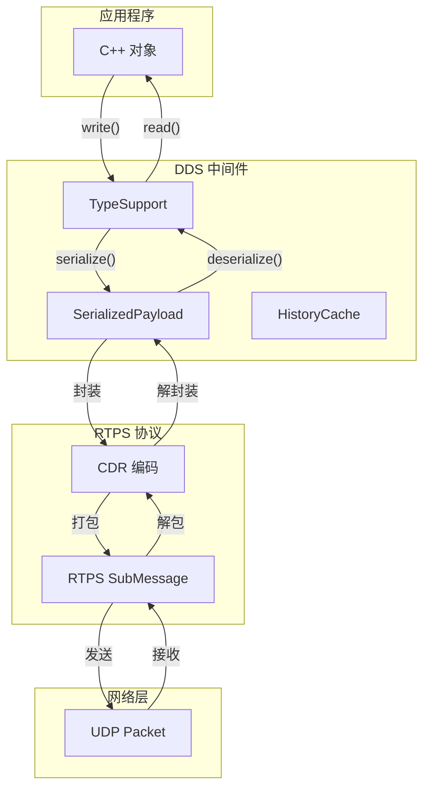
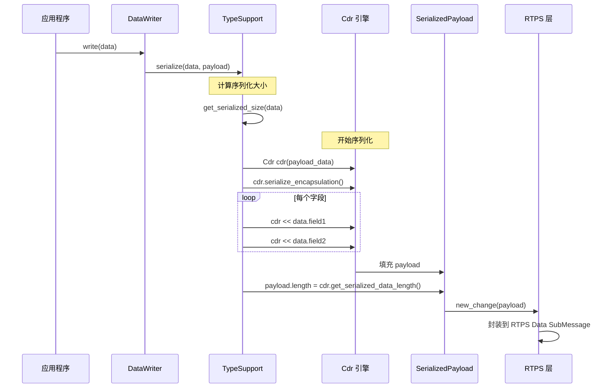

# Fast-DDS 序列化机制详解

## 目录
1. [序列化概述](#1-序列化概述)
2. [CDR 编码规范](#2-cdr-编码规范)
3. [Fast-DDS 序列化架构](#3-fast-dds-序列化架构)
4. [TypeSupport 详解](#4-typesupport-详解)
5. [封装格式与版本](#5-封装格式与版本)
6. [动态类型序列化](#6-动态类型序列化)
7. [源码实现分析](#7-源码实现分析)
8. [性能优化](#8-性能优化)
9. [实战示例](#9-实战示例)

---

## 1. 序列化概述

### 1.1 为什么需要序列化？

```
┌─────────────────────────────────────────────────────────────────┐
│                     序列化的必要性                              │
├─────────────────────────────────────────────────────────────────┤
│                                                                  │
│  内存中的 C++ 对象                                               │
│  ┌─────────────────────────────────────────┐                    │
│  │ struct SensorData {                     │                    │
│  │     string sensor_id;    ────┐          │                    │
│  │     double temperature; ──┐  │          │                    │
│  │     timestamp time;   ──┐ │  │          │                    │
│  │ };                      │ │  │          │                    │
│  │                         │ │  │          │                    │
│  │ 内存布局:               │ │  │          │                    │
│  │ • 指针地址 (64-bit)     │ │  │          │                    │
│  │ • double (8-byte)       │ │  │          │                    │
│  │ • int64 (8-byte)        │ │  │          │                    │
│  │                         ▼ ▼  ▼          │                    │
│  │ 无法直接通过网络传输！                   │                    │
│  └─────────────────────────────────────────┘                    │
│                              │                                   │
│                              ▼                                   │
│  序列化 (Serialization)                                         │
│  ┌─────────────────────────────────────────┐                    │
│  │ 0x00 0x0A 0x00 ...                      │                    │
│  │ 标准字节流 (网络可传输)                  │                    │
│  │ • 长度前缀 (4-byte)                     │                    │
│  │ • UTF-8 字符串内容                      │                    │
│  │ • IEEE 754 double (8-byte)              │                    │
│  │ • int64 (8-byte, 小端序)                │                    │
│  └─────────────────────────────────────────┘                    │
│                              │                                   │
│                              ▼                                   │
│  网络传输 (UDP/TCP/SHM)                                         │
│                              │                                   │
│                              ▼                                   │
│  反序列化 (Deserialization)                                     │
│  ┌─────────────────────────────────────────┐                    │
│  │ struct SensorData {                     │                    │
│  │     string sensor_id;    ← 重建对象      │                    │
│  │     double temperature;                  │                    │
│  │     timestamp time;                      │                    │
│  │ };                                       │                    │
│  └─────────────────────────────────────────┘                    │
│                                                                  │
└─────────────────────────────────────────────────────────────────┘
```

### 1.2 DDS 序列化标准

| 标准 | 全称 | 说明 |
|------|------|------|
| **CDR** | Common Data Representation | OMG IDL 编码规范 |
| **XCDR** | Extended CDR | DDS-XTYPES 扩展 |
| **XCDR2** | Extended CDR v2 | 更紧凑的编码 |

### 1.3 序列化在 DDS 中的位置



---

## 2. CDR 编码规范

### 2.1 CDR 基本规则

CDR (Common Data Representation) 是 OMG 定义的标准二进制编码：

```cpp
// CDR 编码核心原则

// 1. 对齐规则 - 数据按自然边界对齐
//    1-byte: 任意地址
//    2-byte: 偶数地址
//    4-byte: 4的倍数地址
//    8-byte: 8的倍数地址

// 2. 字节序 - 默认大端序 (Big Endian)
//    可通过封装头指定小端序

// 3. 填充 - 不满足对齐时插入填充字节
```

### 2.2 基本类型编码

```cpp
// === 整数编码 ===

// int32 (4-byte, 大端序示例)
int32_t value = 0x12345678;
// 编码: [0x12 0x34 0x56 0x78]

// int16 (2-byte, 大端序)
int16_t value = 0x1234;
// 编码: [0x12 0x34] + [填充 0x00 0x00]  // 对齐到4字节

// === 浮点数编码 (IEEE 754) ===

// double (8-byte)
double value = 3.14159;
// 编码: 8字节 IEEE 754 格式

// float (4-byte)
float value = 3.14f;
// 编码: 4字节 IEEE 754 格式

// === 布尔编码 ===
bool flag = true;
// 编码: [0x01] + [填充到4字节: 0x00 0x00 0x00]

// === 字符编码 ===
char c = 'A';
// 编码: [0x41] + [填充到4字节]
```

### 2.3 字符串编码

```cpp
// CDR 字符串格式:
// [长度(4-byte, 含null终止符)] [内容] [null终止符] [填充]

// 示例: "Hello"
string str = "Hello";
// 编码:
// [0x00 0x00 0x00 0x06]  // 长度 = 6 (5字符 + 1 null)
// [0x48 0x65 0x6C 0x6C 0x6F 0x00]  // "Hello\0"
// (无需填充，已对齐)

// 示例: "Hi"
string str = "Hi";
// 编码:
// [0x00 0x00 0x00 0x03]  // 长度 = 3
// [0x48 0x69 0x00]       // "Hi\0"
// [0x00]                 // 填充到4字节对齐
```

### 2.4 结构体编码

```cpp
// IDL
struct SensorData {
    string sensor_id;      // @key
    double temperature;
    int32_t status;
};

// C++ 数据
SensorData data;
data.sensor_id = "TEMP001";  // 8字符 + null = 9
data.temperature = 25.5;
data.status = 1;

// CDR 编码结果:
// Offset  Content                         Size  Alignment
// 0x00    [0x00 0x00 0x00 0x09]          4     length
// 0x04    "TEMP001\0"                     9     string
// 0x0D    [0x00 0x00 0x00]               3     padding
// 0x10    [temperature: 8 bytes]         8     double
// 0x18    [status: 4 bytes]              4     int32
// Total: 28 bytes

// 内存布局可视化:
// 00: 00 00 00 09    <- 字符串长度 (9)
// 04: 54 45 4D 50    <- "TEMP"
// 08: 30 30 31 00    <- "001\0"
// 0C: 00 00 00       <- padding (对齐到 0x10)
// 10: xx xx xx xx    <- temperature (8 bytes)
// 14: xx xx xx xx
// 18: 00 00 00 01    <- status (1)
```

### 2.5 数组与序列编码

```cpp
// === 定长数组 ===
// IDL: int32_t values[4];
int32_t values[4] = {1, 2, 3, 4};
// 编码: 4 * 4 = 16 bytes，无长度前缀，无填充

// === 变长序列 (sequence) ===
// IDL: sequence<int32_t> values;
vector<int32_t> values = {1, 2, 3};
// 编码:
// [0x00 0x00 0x00 0x03]  // 长度 = 3
// [0x00 0x00 0x00 0x01]  // values[0]
// [0x00 0x00 0x00 0x02]  // values[1]
// [0x00 0x00 0x00 0x03]  // values[2]

// === 字节序列 (octet sequence) ===
// IDL: sequence<octet> raw_data;
// 优化: 元素无对齐要求，紧凑排列
```

---

## 3. Fast-DDS 序列化架构

### 3.1 核心类图

```cpp
// 序列化架构核心类

┌─────────────────────────────────────────────────────────────────┐
│                         序列化架构                              │
├─────────────────────────────────────────────────────────────────┤
│                                                                  │
│  TypeSupport (抽象基类)                                         │
│  ├── serialize()        → 对象 → SerializedPayload              │
│  ├── deserialize()      → SerializedPayload → 对象              │
│  ├── get_serialized_size_provider()                            │
│  └── create_data() / delete_data()                             │
│         │                                                        │
│         │ 派生                                                   │
│         ▼                                                        │
│  GeneratedTypeSupport (IDL 生成)                                │
│  ├── 具体类型的序列化实现                                        │
│  └── 使用 Cdr 类进行编码                                         │
│                                                                  │
│  Cdr (序列化引擎)                                                │
│  ├── serialize(int16/int32/int64/float/double/string...)        │
│  ├── serialize_array()                                          │
│  ├── serialize_sequence()                                       │
│  └── 处理字节序和对齐                                            │
│                                                                  │
│  SerializedPayload_t (序列化结果)                               │
│  ├── data (uint8_t*)    → 原始字节                              │
│  ├── length (uint32_t)  → 有效长度                              │
│  ├── max_size           → 最大容量                              │
│  └── encapsulation      → 封装格式                              │
│                                                                  │
│  CdrMessage (RTPS 消息)                                         │
│  ├── 封装 CDR 数据到 RTPS 子消息                                │
│  └── 添加 RTPS 头部和标识                                        │
│                                                                  │
└─────────────────────────────────────────────────────────────────┘
```

### 3.2 序列化流程



### 3.3 反序列化流程

```
┌─────────────────────────────────────────────────────────────────┐
│                      反序列化流程                               │
├─────────────────────────────────────────────────────────────────┤
│                                                                  │
│  接收端                                                          │
│  ┌─────────┐     ┌─────────┐     ┌─────────┐     ┌─────────┐  │
│  │ Network │────→│  RTPS   │────→│  CDR    │────→│   App   │  │
│  └─────────┘     └─────────┘     └─────────┘     └─────────┘  │
│       │               │               │               │        │
│       ▼               ▼               ▼               ▼        │
│   UDP Packet     SubMessage      Serialized       C++ Object   │
│   (字节流)       提取 payload      Payload         (数据)      │
│                                     │                            │
│                                     ▼                            │
│                               Cdr cdr(payload)                   │
│                               cdr.read_encapsulation()           │
│                               cdr >> obj.field1                 │
│                               cdr >> obj.field2                 │
│                               ...                                │
│                                                                  │
└─────────────────────────────────────────────────────────────────┘
```

---

## 4. TypeSupport 详解

### 4.1 TypeSupport 接口

```cpp
// include/fastdds/dds/topic/TypeSupport.hpp

class TypeSupport : public std::shared_ptr<fastdds::dds::TopicDataType>
{
public:
    // === 序列化 ===
    bool serialize(
        void* data,
        SerializedPayload_t* payload,
        DataRepresentationId_t data_representation);

    // === 反序列化 ===
    bool deserialize(
        SerializedPayload_t* payload,
        void* data);

    // === 获取序列化大小 ===
    std::function<uint32_t()> get_serialized_size_provider(
        void* data,
        DataRepresentationId_t data_representation);

    // === 数据生命周期管理 ===
    void* create_data();
    void delete_data(void* data);

    // === 类型信息 ===
    const std::string& get_type_name() const;
    bool is_bounded() const;
    bool is_plain() const;

    // === 注册 ===
    ReturnCode_t register_type(DomainParticipant* participant) const;
};
```

### 4.2 IDL 生成的 TypeSupport

```cpp
// === IDL 定义 ===
// Sensor.idl
struct SensorData {
    @key string sensor_id;
    double temperature;
    int32_t status;
};

// === 生成的 C++ 代码 (简化) ===
// SensorPubSubTypes.h

class SensorDataPubSubType : public eprosima::fastdds::dds::TopicDataType
{
public:
    SensorDataPubSubType()
    {
        setName("SensorData");
        m_typeSize = 4 + 4 + 8 + 4;  // 最大序列化大小（含填充）
        m_isGetKeyDefined = true;
    }

    // 序列化
    bool serialize(
        void* data,
        SerializedPayload_t* payload) override
    {
        SensorData* p_type = static_cast<SensorData*>(data);

        // 1. 计算大小
        uint32_t ser_size = calculate_serialized_size(*p_type);

        // 2. 分配内存
        payload->data = new uint8_t[ser_size];
        payload->max_size = ser_size;

        // 3. 使用 Cdr 序列化
        eprosima::fastcdr::Cdr cdr(
            reinterpret_cast<eprosima::fastcdr::FastBuffer*>(payload->data),
            eprosima::fastcdr::Cdr::DEFAULT_ENDIAN);

        // 4. 写入封装头
        cdr.serialize_encapsulation();

        // 5. 写入数据
        cdr << p_type->sensor_id;
        cdr << p_type->temperature;
        cdr << p_type->status;

        // 6. 设置长度
        payload->length = static_cast<uint32_t>(cdr.getSerializedDataLength());

        return true;
    }

    // 反序列化
    bool deserialize(SerializedPayload_t* payload, void* data) override
    {
        SensorData* p_type = static_cast<SensorData*>(data);

        eprosima::fastcdr::Cdr cdr(
            reinterpret_cast<eprosima::fastcdr::FastBuffer*>(payload->data),
            payload->length);

        // 1. 读取封装头
        cdr.read_encapsulation();

        // 2. 读取数据
        cdr >> p_type->sensor_id;
        cdr >> p_type->temperature;
        cdr >> p_type->status;

        return true;
    }

    // 计算 Key
    bool getKey(void* data, InstanceHandle_t* handle) override
    {
        SensorData* p_type = static_cast<SensorData*>(data);

        // 只序列化 @key 字段
        eprosima::fastcdr::Cdr cdr(...);
        cdr << p_type->sensor_id;  // 只序列化 key 字段

        // 计算 MD5 作为 handle
        MD5 md5;
        md5.update(cdr.getBufferPointer(), cdr.getSerializedDataLength());
        md5.finalize();
        memcpy(handle->value, md5.digest, 16);

        return true;
    }
};
```

### 4.3 自定义 TypeSupport

```cpp
// === 自定义序列化实现 ===

class CustomSensorTypeSupport : public TopicDataType
{
public:
    CustomSensorTypeSupport()
    {
        setName("CustomSensor");
        m_typeSize = 1024;
        m_isGetKeyDefined = false;
    }

    bool serialize(void* data, SerializedPayload_t* payload) override
    {
        CustomSensor* sensor = static_cast<CustomSensor*>(data);

        // 使用自定义编码（例如：压缩）
        std::vector<uint8_t> buffer;

        // 自定义格式: [magic(4)] [version(1)] [compressed_data]
        buffer.push_back(0x43);  // 'C'
        buffer.push_back(0x55);  // 'U'
        buffer.push_back(0x53);  // 'S'
        buffer.push_back(0x54);  // 'T'
        buffer.push_back(0x01);  // version

        // 压缩数据
        compress(sensor, buffer);

        // 复制到 payload
        payload->data = new uint8_t[buffer.size()];
        memcpy(payload->data, buffer.data(), buffer.size());
        payload->length = buffer.size();
        payload->max_size = buffer.size();

        return true;
    }

    bool deserialize(SerializedPayload_t* payload, void* data) override
    {
        CustomSensor* sensor = static_cast<CustomSensor*>(data);

        // 验证 magic
        if (payload->data[0] != 0x43 ||
            payload->data[1] != 0x55 ||
            payload->data[2] != 0x53 ||
            payload->data[3] != 0x54) {
            return false;
        }

        // 解压缩
        decompress(payload->data + 5, payload->length - 5, sensor);

        return true;
    }
};
```

---

## 5. 封装格式与版本

### 5.1 封装头格式

```cpp
// CDR 封装头 (4 bytes)
// ┌─────────────────────────────────────┐
// │ 0x00 0x01 │ 0x00 0x00              │
// │ 封装标识   │ 选项（保留）            │
// └─────────────────────────────────────┘
//
// 封装标识解码：
// 位 0-1: 字节序
//   00 = 大端 (Big Endian)
//   01 = 小端 (Little Endian)
//
// 位 2-5: 封装版本
//   0000 = CDR (DDS 早期)
//   0001 = PL_CDR (参数列表)
//   0010 = CDR2
//   0011 = PL_CDR2
//   0100 = D_CDR (Delimited)

// 封装标识常量
constexpr uint16_t CDR_BE = 0x0000;      // CDR Big Endian
constexpr uint16_t CDR_LE = 0x0001;      // CDR Little Endian
constexpr uint16_t PL_CDR_BE = 0x0002;   // Parameter List Big Endian
constexpr uint16_t PL_CDR_LE = 0x0003;   // Parameter List Little Endian
constexpr uint16_t CDR2_BE = 0x0006;     // CDR2 Big Endian
constexpr uint16_t CDR2_LE = 0x0007;     // CDR2 Little Endian
```

### 5.2 数据表示格式

| 格式 | ID | 说明 | 适用场景 |
|------|-----|------|---------|
| **CDR** | 0x0000/0x0001 | 经典 CDR | 兼容旧系统 |
| **XCDR** | 0x0002/0x0003 | 扩展 CDR (XTypes) | 默认推荐 |
| **XCDR2** | 0x0006/0x0007 | 紧凑编码 | 带宽敏感 |
| **XML** | - | 文本格式 | 调试（非生产） |

### 5.3 配置数据表示

```cpp
#include <fastdds/dds/domain/DomainParticipantFactory.hpp>
#include <fastdds/dds/core/policy/QosPolicies.hpp>

using namespace eprosima::fastdds::dds;

// 方式1: 代码配置 DataRepresentationQos
void configure_data_representation()
{
    DataWriterQos writer_qos;

    // 配置支持的数据表示格式（按优先级排序）
    writer_qos.representation().m_value.push_back(
        DataRepresentationId_t::XCDR2);  // 首选 XCDR2
    writer_qos.representation().m_value.push_back(
        DataRepresentationId_t::XCDR1);  // 次选 XCDR
    writer_qos.representation().m_value.push_back(
        DataRepresentationId_t::CDR_DATA);  // 兼容旧版

    // 创建 DataWriter
    DataWriter* writer = publisher->create_datawriter(topic, writer_qos);
}

// 方式2: XML 配置
/*
<data_writer>
    <qos>
        <dataRepresentation>
            <value>
                <element>XCDR2</element>
                <element>XCDR</element>
            </value>
        </dataRepresentation>
    </qos>
</data_writer>
*/

// Reader 配置（必须兼容 Writer）
void configure_reader_representation()
{
    DataReaderQos reader_qos;

    // Reader 声明支持哪些格式
    reader_qos.representation().m_value.push_back(
        DataRepresentationId_t::XCDR2);
    reader_qos.representation().m_value.push_back(
        DataRepresentationId_t::XCDR1);

    // 如果 Writer 和 Reader 没有共同的表示格式，匹配会失败
    DataReader* reader = subscriber->create_datareader(topic, reader_qos);
}
```

---

## 6. 动态类型序列化

### 6.1 动态类型概述

```cpp
// 静态类型（编译时确定）
SensorData data;  // 结构固定

// 动态类型（运行时确定）
DynamicType_ptr dynamic_type = ...;  // 运行时构建类型
DynamicData_ptr data = DynamicDataFactory::get_instance()
    ->create_data(dynamic_type);
```

### 6.2 动态类型序列化

```cpp
#include <fastdds/dds/xtypes/dynamic_types/DynamicData.hpp>
#include <fastdds/dds/xtypes/dynamic_types/DynamicDataFactory.hpp>

using namespace eprosima::fastdds::dds;

// 序列化动态类型数据
bool serialize_dynamic_data(
    DynamicData_ptr data,
    SerializedPayload_t* payload)
{
    // 使用 DynamicData 的序列化方法
    DynamicDataFactory* factory = DynamicDataFactory::get_instance();

    // 获取序列化大小
    uint32_t size = data->get_cdr_serialized_size();

    // 分配内存
    payload->data = new uint8_t[size];
    payload->max_size = size;

    // 使用 Cdr 序列化
    eprosima::fastcdr::Cdr cdr(
        reinterpret_cast<eprosima::fastcdr::FastBuffer*>(payload->data),
        eprosima::fastcdr::Cdr::DEFAULT_ENDIAN);

    // 写入封装头
    cdr.serialize_encapsulation();

    // 序列化动态数据
    data->serialize(cdr);

    payload->length = cdr.getSerializedDataLength();

    return true;
}

// 反序列化动态类型数据
bool deserialize_dynamic_data(
    SerializedPayload_t* payload,
    DynamicType_ptr type,
    DynamicData_ptr& data)
{
    // 创建 DynamicData 实例
    data = DynamicDataFactory::get_instance()->create_data(type);

    // 使用 Cdr 反序列化
    eprosima::fastcdr::Cdr cdr(
        reinterpret_cast<eprosima::fastcdr::FastBuffer*>(payload->data),
        payload->length);

    // 读取封装头
    cdr.read_encapsulation();

    // 反序列化动态数据
    data->deserialize(cdr);

    return true;
}
```

### 6.3 Type Lookup Service

```cpp
// 动态类型发现 - Type Lookup Service

// Writer 端: 发布类型信息
void publish_with_type_info()
{
    DomainParticipantQos qos;

    // 启用类型传播
    qos.wire_protocol().builtin.typelookup_config.use_server = true;

    DomainParticipant* participant =
        DomainParticipantFactory::get_instance()-
003ecreate_participant(0, qos);

    // 注册动态类型
    TypeSupport type_support(new DynamicPubSubType(dynamic_type));
    type_support.register_type(participant);

    // 创建 Topic
    Topic* topic = participant->create_topic("DynamicTopic", dynamic_type->get_name());
}

// Reader 端: 自动获取类型信息
void subscribe_with_dynamic_type()
{
    DomainParticipantQos qos;
    qos.wire_protocol().builtin.typelookup_config.use_client = true;

    DomainParticipant* participant = ...;

    // 创建 Topic（此时类型可能还不知道）
    Topic* topic = participant->create_topic("DynamicTopic", "UnknownType");

    // 设置监听器，等待类型发现完成
    class DynamicTypeListener : public DomainParticipantListener
    {
    public:
        void on_type_discovery(...)
        {
            // 类型发现完成，可以创建 Reader 了
        }
    };
}
```

---

## 7. 源码实现分析

### 7.1 Cdr 类核心实现

```cpp
// include/fastcdr/Cdr.h

namespace eprosima::fastcdr {

class Cdr
{
public:
    // === 构造函数 ===
    Cdr(FastBuffer* buffer, Endianness endianness = DEFAULT_ENDIAN);

    // === 封装头 ===
    void serialize_encapsulation();
    void deserialize_encapsulation();

    // === 基本类型 ===
    Cdr& operator<<(int16_t value);
    Cdr& operator<<(int32_t value);
    Cdr& operator<<(int64_t value);
    Cdr& operator<<(float value);
    Cdr& operator<<(double value);
    Cdr& operator<<(const std::string& value);
    Cdr& operator<<(bool value);

    // === 反序列化 ===
    Cdr& operator>>(int16_t& value);
    Cdr& operator>>(int32_t& value);
    Cdr& operator>>(std::string& value);
    // ...

    // === 数组 ===
    template<typename T>
    Cdr& serializeArray(const T* array, size_t size);

    // === 序列 ===
    template<typename T>
    Cdr& serializeSequence(const std::vector<T>& sequence);

    // === 对齐 ===
    void align(size_t alignment);
    size_t getCurrentPosition() const;

    // === 字节序 ===
    void changeEndianness(Endianness endianness);
    Endianness getEndianness() const;

private:
    FastBuffer* m_buffer;        // 底层缓冲区
    size_t m_currentPosition;    // 当前位置
    Endianness m_endianness;     // 字节序
    bool m_swapBytes;            // 是否需要交换字节
};

} // namespace eprosima::fastcdr
```

### 7.2 序列化实现细节

```cpp
// src/cpp/fastcdr/Cdr.cpp

// int32 序列化
Cdr& Cdr::operator<<(int32_t value)
{
    // 1. 对齐到 4 字节边界
    align(4);

    // 2. 检查缓冲区空间
    if (m_currentPosition + 4 > m_buffer->getBufferSize()) {
        throw NotEnoughMemoryException();
    }

    // 3. 写入数据（考虑字节序）
    if (m_swapBytes) {
        // 交换字节序
        uint32_t swapped = swap_bytes(static_cast<uint32_t>(value));
        memcpy(m_buffer->getBuffer() + m_currentPosition, &swapped, 4);
    } else {
        memcpy(m_buffer->getBuffer() + m_currentPosition, &value, 4);
    }

    // 4. 更新位置
    m_currentPosition += 4;

    return *this;
}

// 字符串序列化
Cdr& Cdr::operator<<(const std::string& value)
{
    // 1. 字符串长度（含 null 终止符）
    uint32_t length = value.length() + 1;

    // 2. 序列化长度
    *this << length;

    // 3. 序列化内容
    if (length > 1) {
        serializeArray(value.c_str(), length);
    } else {
        // 空字符串，只写 null
        char null = '\0';
        serializeArray(&null, 1);
    }

    // 4. 对齐到 4 字节
    align(4);

    return *this;
}

// 对齐函数
void Cdr::align(size_t alignment)
{
    size_t remainder = m_currentPosition % alignment;
    if (remainder != 0) {
        size_t padding = alignment - remainder;

        // 检查空间
        if (m_currentPosition + padding > m_buffer->getBufferSize()) {
            throw NotEnoughMemoryException();
        }

        // 填充 0
        memset(m_buffer->getBuffer() + m_currentPosition, 0, padding);
        m_currentPosition += padding;
    }
}
```

### 7.3 SerializedPayload 管理

```cpp
// include/fastdds/rtps/common/SerializedPayload.h

struct SerializedPayload_t
{
    uint16_t encapsulation;   // 封装格式标识
    uint32_t length;          // 有效数据长度
    octet* data;              // 数据指针
    uint32_t max_size;        // 最大容量
    bool pos;                 // 是否拥有 data 内存

    // 构造函数
    SerializedPayload_t()
        : encapsulation(0)
        , length(0)
        , data(nullptr)
        , max_size(0)
        , pos(false)
    {}

    // 预留空间
    bool reserve(uint32_t size)
    {
        if (max_size < size) {
            if (data != nullptr && pos) {
                delete[] data;
            }
            data = new octet[size];
            max_size = size;
            pos = true;
        }
        return true;
    }

    // 复制
    bool copy(const SerializedPayload_t* src, bool with_limit = true)
    {
        if (with_limit && max_size < src->length) {
            return false;
        }

        length = src->length;
        encapsulation = src->encapsulation;
        memcpy(data, src->data, length);

        return true;
    }

    // 提取 key hash（用于 Instance 管理）
    bool extract_key_hash(MD5* md5) const
    {
        // 从 payload 中提取 key 字段并计算 hash
        // ...
        return true;
    }
};
```

---

## 8. 性能优化

### 8.1 序列化性能优化技巧

```cpp
// === 优化1: 预分配内存 ===

// ❌ 差：频繁分配
void bad_serialize()
{
    for (int i = 0; i < 1000; i++) {
        SerializedPayload_t payload;
        payload.reserve(1024);  // 每次分配
        serialize(data[i], &payload);
    }
}

// ✅ 好：重用 payload
void good_serialize()
{
    SerializedPayload_t payload;
    payload.reserve(1024);  // 只分配一次

    for (int i = 0; i < 1000; i++) {
        payload.length = 0;  // 重置长度
        serialize(data[i], &payload);
    }
}

// === 优化2: 零拷贝 (DataSharing) ===

void configure_zero_copy()
{
    DataWriterQos qos;

    // 启用 DataSharing（共享内存，避免序列化拷贝）
    qos.data_sharing().on("shared_memory_name");

    // 对于大消息，避免序列化开销
    qos.publish_mode().kind = SYNCHRONOUS;
}

// === 优化3: 压缩大数据 ===

#include <zlib.h>

bool compress_and_serialize(void* data, SerializedPayload_t* payload)
{
    // 1. 先正常序列化到临时缓冲区
    uint8_t raw_buffer[1024];
    uint32_t raw_size = serialize_to_buffer(data, raw_buffer);

    // 2. 压缩
    uLongf compressed_size = compressBound(raw_size);
    uint8_t* compressed = new uint8_t[compressed_size];

    compress(compressed, &compressed_size, raw_buffer, raw_size);

    // 3. 存储压缩数据
    payload->data = compressed;
    payload->length = compressed_size;

    return true;
}

// === 优化4: 使用 Plain 类型 ===

// Plain 类型：内存布局与序列化格式一致，可直接 memcpy
// 要求：
// - 固定大小
// - 无指针（无 string/vector）
// - 对齐正确

struct PlainSensorData  // Plain 类型
{
    char sensor_id[16];    // 固定长度数组，非 string
    double temperature;
    int32_t status;
} __attribute__((packed));
// 可以直接 memcpy，无需复杂序列化

struct NonPlainSensorData  // 非 Plain 类型
{
    std::string sensor_id;  // 动态分配
    double temperature;
    int32_t status;
};
```

### 8.2 选择合适的编码格式

| 格式 | 编码大小 | 速度 | 适用场景 |
|------|---------|------|---------|
| CDR | 中等 | 快 | 兼容性优先 |
| XCDR | 中等 | 快 | 默认推荐 |
| XCDR2 | 最小 | 中等 | 带宽敏感 |
| XML | 最大 | 慢 | 调试 only |

```cpp
// 带宽敏感场景使用 XCDR2
void configure_for_bandwidth()
{
    DataWriterQos qos;

    // XCDR2 使用更紧凑的编码
    qos.representation().m_value.clear();
    qos.representation().m_value.push_back(
        DataRepresentationId_t::XCDR2);

    // 启用内容过滤（减少不必要的数据传输）
    // ...
}
```

---

## 9. 实战示例

### 9.1 示例1: 大消息序列化

```cpp
// 场景: 传输高清图像数据 (1MB+)

struct ImageFrame
{
    uint32_t width;
    uint32_t height;
    std::vector<uint8_t> pixel_data;  // 大内存块
};

class ImageTypeSupport : public TopicDataType
{
public:
    bool serialize(void* data, SerializedPayload_t* payload) override
    {
        ImageFrame* frame = static_cast<ImageFrame*>(data);

        // 1. 计算总大小
        uint32_t total_size =
            4 +                         // width
            4 +                         // height
            4 +                         // pixel_data size
            frame->pixel_data.size();   // actual data

        // 2. 预分配
        payload->reserve(total_size + 100);  // 留点余量

        // 3. 使用 Cdr
        eprosima::fastcdr::Cdr cdr(
            reinterpret_cast<eprosima::fastcdr::FastBuffer*>(
                payload->data),
            eprosima::fastcdr::Cdr::DEFAULT_ENDIAN);

        cdr.serialize_encapsulation();
        cdr << frame->width;
        cdr << frame->height;
        cdr <>> frame->pixel_data;  // 序列化 vector

        payload->length = cdr.getSerializedDataLength();

        return true;
    }

    bool deserialize(SerializedPayload_t* payload, void* data) override
    {
        ImageFrame* frame = static_cast<ImageFrame*>(data);

        eprosima::fastcdr::Cdr cdr(
            reinterpret_cast<eprosima::fastcdr::FastBuffer*>(
                payload->data),
            payload->length);

        cdr.read_encapsulation();
        cdr >> frame->width;
        cdr >> frame->height;
        cdr >> frame->pixel_data;

        return true;
    }
};

// 使用 DataSharing 避免拷贝
void setup_image_transport()
{
    DataWriterQos qos;

    // 启用共享内存传输
    qos.data_sharing().automatic();

    // 设置大消息阈值
    qos.publish_mode().kind = ASYNCHRONOUS;

    DataWriter* writer = publisher->create_datawriter(topic, qos);
}
```

### 9.2 示例2: 版本兼容序列化

```cpp
// 场景: 新旧版本系统兼容

// V1 数据结构
struct SensorDataV1
{
    string sensor_id;
    double temperature;
};

// V2 数据结构（添加了字段）
struct SensorDataV2
{
    string sensor_id;
    double temperature;
    double humidity;    // 新增
    int32_t status;     // 新增
};

// 使用 XCDR2 的可扩展编码
void setup_version_compatible()
{
    DataWriterQos writer_qos;
    writer_qos.representation().m_value.push_back(
        DataRepresentationId_t::XCDR2);

    // XCDR2 的 D_CDR 格式支持字段增减
    DataWriter* writer = publisher->create_datawriter(topic, writer_qos);
}

// Reader 端处理未知字段
class VersionedListener : public DataReaderListener
{
public:
    void on_data_available(DataReader* reader) override
    {
        LoanableSequence<DynamicData> data;
        SampleInfoSeq info;

        reader->take(data, info);

        for (size_t i = 0; i < data.length(); i++) {
            // 使用动态数据访问，忽略版本差异
            DynamicData* dyn = data[i];

            string sensor_id;
            dyn->get_string_value(sensor_id, dyn->get_member_id_by_name("sensor_id"));

            double temperature;
            dyn->get_float64_value(temperature, dyn->get_member_id_by_name("temperature"));

            //  humidity 可能不存在，检查后再读取
            MemberId humidity_id = dyn->get_member_id_by_name("humidity");
            if (humidity_id != MEMBER_ID_INVALID) {
                double humidity;
                dyn->get_float64_value(humidity, humidity_id);
            }
        }
    }
};
```

### 9.3 示例3: 自定义二进制协议

```cpp
// 场景: 与非 DDS 系统通信（需要自定义格式）

struct CustomPacket
{
    uint8_t magic[4];       // "MYAPP"
    uint8_t version;        // 协议版本
    uint16_t msg_type;      // 消息类型
    uint32_t payload_len;   // 载荷长度
    std::vector<uint8_t> payload;
};

class CustomProtocolTypeSupport : public TopicDataType
{
public:
    bool serialize(void* data, SerializedPayload_t* payload) override
    {
        CustomPacket* packet = static_cast<CustomPacket*>(data);

        uint32_t total_size =
            4 +     // magic
            1 +     // version
            2 +     // msg_type
            4 +     // payload_len
            packet->payload.size();

        payload->reserve(total_size);

        uint8_t* ptr = payload->data;

        // 手动序列化（不使用 CDR）
        memcpy(ptr, packet->magic, 4);
        ptr += 4;

        *ptr++ = packet->version;

        // 大端序编码 msg_type
        *ptr++ = (packet->msg_type >> 8) & 0xFF;
        *ptr++ = packet->msg_type & 0xFF;

        // 大端序编码 payload_len
        *ptr++ = (packet->payload_len >> 24) & 0xFF;
        *ptr++ = (packet->payload_len >> 16) & 0xFF;
        *ptr++ = (packet->payload_len >> 8) & 0xFF;
        *ptr++ = packet->payload_len & 0xFF;

        // payload
        memcpy(ptr, packet->payload.data(), packet->payload.size());

        payload->length = total_size;

        // 不设置封装格式（自定义协议）
        payload->encapsulation = 0;

        return true;
    }

    bool deserialize(SerializedPayload_t* payload, void* data) override
    {
        CustomPacket* packet = static_cast<CustomPacket*>(data);

        uint8_t* ptr = payload->data;

        // 验证 magic
        if (memcmp(ptr, "MYAPP", 4) != 0) {
            return false;
        }
        memcpy(packet->magic, ptr, 4);
        ptr += 4;

        packet->version = *ptr++;

        // 大端序解码
        packet->msg_type = (*ptr << 8) | *(ptr + 1);
        ptr += 2;

        packet->payload_len =
            (*ptr << 24) |
            (*(ptr + 1) << 16) |
            (*(ptr + 2) << 8) |
            *(ptr + 3);
        ptr += 4;

        // 复制 payload
        packet->payload.assign(ptr, ptr + packet->payload_len);

        return true;
    }
};
```

---

## 总结

```
┌─────────────────────────────────────────────────────────────────┐
│                     Fast-DDS 序列化总结                        │
├─────────────────────────────────────────────────────────────────┤
│                                                                  │
│  核心组件                                                       │
│  ├── TypeSupport: 类型注册与序列化接口                          │
│  ├── Cdr: 序列化引擎，处理 CDR/XCDR 编码                        │
│  └── SerializedPayload: 序列化结果容器                          │
│                                                                  │
│  编码标准                                                       │
│  ├── CDR: OMG 标准，大端序，对齐                                │
│  ├── XCDR: DDS-XTYPES 扩展，支持动态类型                        │
│  └── XCDR2: 更紧凑的编码                                        │
│                                                                  │
│  关键概念                                                       │
│  ├── 封装头: 4字节，标识字节序和编码版本                        │
│  ├── 对齐: 数据按自然边界对齐（2/4/8字节）                      │
│  └── 字节序: 默认大端，可配置小端                               │
│                                                                  │
│  性能优化                                                       │
│  ├── 预分配内存，避免频繁分配                                   │
│  ├── 使用 DataSharing 避免拷贝                                  │
│  └── 选择合适的编码格式（XCDR2 更紧凑）                         │
│                                                                  │
│  高级特性                                                       │
│  ├── 动态类型: DynamicType + Type Lookup Service                │
│  └── 自定义序列化: 实现 TopicDataType 接口                      │
│                                                                  │
└─────────────────────────────────────────────────────────────────┘
```

---

*文档版本: 1.0*  
*基于 Fast-DDS 2.14.x 和 fastcdr 2.x*
